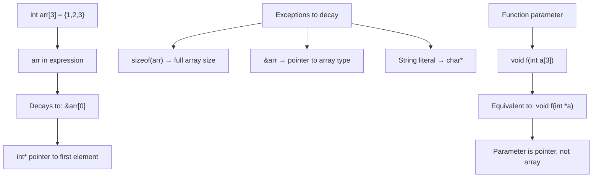

# Lesson 0042: Array-to-Pointer Decay

## Status: ✅ Complete | Phase: Advanced Types | Effort: Easy (2-3h)

## Objective

Implement automatic conversion from array to pointer. In C, an
array used in an expression context "decays" to a pointer to its
first element. The codegen models this by emitting `lea` (the
address) for array identifiers and by treating `int arr[]`
function parameters as `int*`.

## Array-to-Pointer Decay



## Implementation Checklist

- [x] Array name in expression → pointer to first element
      (`lea` in `visit(IdentifierExprNode)`)
- [x] Function parameters: arrays become pointers
- [x] Test: `int a[3] = {1,2,3}; int *p = a; return *p;` → 1

## Implementation Details

The core trick: two small pieces of codegen/parser cooperation
cover all the cases. The parser rewrites `int arr[]` parameters
to `int arr*` (a string-typed flag), and the codegen checks the
same `array_info_` map to decide whether an identifier should
emit `lea` (decay) or `mov` (the value).

### Codegen — identifier decays to base

`visit(IdentifierExprNode&)` looks up the name in
`array_info_` and, if present, emits `lea offset(%rbp), %rax`
instead of a load. The result is the address of the first
element — i.e. the decayed pointer value
(`src/codegen.cpp:1547-1583`):

```cpp
// src/codegen.cpp:1553-1583 (abridged)
void CodeGenerator::visit(IdentifierExprNode& node) {
    std::string var_type = "int";
    if (variable_types_.count(node.name)) {
        var_type = variable_types_[node.name];
    }

    if (local_variables_.count(node.name)) {
        int offset = local_variables_[node.name];
        // For arrays, return the address (base of the array)
        if (array_info_.count(node.name)) {
            emit("lea " + std::to_string(offset) + "(%rbp), %rax");
            push_expr_type(var_type);
            return;
        }
        // Use the variable's size for the load
        int sz = 8;
        if (variable_types_.count(node.name)) {
            sz = get_type_size(variable_types_[node.name]);
        }
        if (is_float_type(var_type)) {
            ...
        } else if (sz == 1) {
            emit("movzbl " + std::to_string(offset) + "(%rbp), %eax");
        } else if (sz == 2) {
            emit("movzwl " + std::to_string(offset) + "(%rbp), %eax");
        } else if (sz == 4) {
            emit("movl " + std::to_string(offset) + "(%rbp), %eax");
        } else {
            emit("mov " + std::to_string(offset) + "(%rbp), %rax");
        }
        ...
    }
    ...
}
```

For global arrays, the same `lea` is emitted using
`%rip`-relative addressing (`src/codegen.cpp:1600-1611`).

### Parser — parameter decay

`parse_param()` accepts the `int arr[10]` syntax and appends
`"*"` to the type string, turning the parameter into a
pointer. The brackets and the optional size are dropped
(`src/parser.cpp:967-972`):

```cpp
// src/parser.cpp:967-972
// Handle array parameter syntax: name[size]
if (match(TokenType::LBRACKET)) {
    if (check(TokenType::INTEGER)) advance(); // consume size
    expect(TokenType::RBRACKET);
    param->type_name += "*"; // decay to pointer
}
```

So `void f(int a[3])` and `void f(int a[])` and
`void f(int *a)` are all the same parameter type as far as
the codegen is concerned: `int*`.

## Example

```c
// src/example.c
void f(int *p) {}
int main() { int arr[3] = {1,2,3}; f(arr); return arr[0]; }
```

The call `f(arr)` passes the pointer value of `arr`. Inside
`main`, `arr` is in `array_info_` with `elem_size = 4`,
`length = 3`, so `visit(IdentifierExprNode&)` emits
`lea -12(%rbp), %rax` (the address of the first element) and
pushes it as the first argument. The callee stores it in its
own parameter slot. The `arr[0]` read at the end goes through
`visit(IndexExprNode&)`, which uses the same `array_info_`
entry to load the first int.

## Source Code References

| Component | File | Lines | Description |
|-----------|------|-------|-------------|
| Array parameter decay | `src/parser.cpp` | `967-972` | `param->type_name += "*"` |
| Parameter parsing | `src/parser.cpp` | `937-975` | Full `parse_param()` |
| Identifier for arrays | `src/codegen.cpp` | `1553-1583` | `lea offset(%rbp), %rax` for arrays |
| Global array identifier | `src/codegen.cpp` | `1600-1611` | `lea name(%rip), %rax` for globals |
| Array info tracking | `src/codegen.cpp` | `483-485` | Populated in `visit(VarDeclNode&)` |
| Index codegen | `src/codegen.cpp` | `1367-1425` | `base + i * elem_size` |
| `sizeof` for arrays | `src/codegen.cpp` | `~1130-1140` | Uses `array_info_` for full size |

## Status

- **Lexer / Parser / Codegen**: ✅ Array names decay to
  pointers in expression context, and `int arr[]` parameters
  are stored as `int*`.
- **Note (`sizeof` exception)**: The `sizeof(arr)` exception
  (full array size, not pointer size) is implemented
  correctly because `sizeof` looks at the **declaration** in
  `array_info_`, not the identifier's emitted value.
- **Note (`&arr` exception)**: The `&arr` exception (pointer
  to array, not pointer to first element) is **not** modelled
  — `&arr` and `arr` produce the same `lea` instruction in
  this codegen. In practice this is rarely observable because
  pointer arithmetic on the two would yield different results,
  and we don't model pointer arithmetic on the array type
  distinctly.
