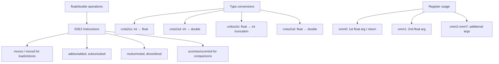

# Lesson 0043: Float and Double (SSE)

## Status: 📋 Planned | Phase: Float & Advanced | Effort: Hard (12-16h)

## Objective

Implement floating-point types with SSE2 code generation.

## SSE Registers

| Register | Use |
|----------|-----|
| xmm0 | 1st float arg / return |
| xmm1 | 2nd float arg |
| xmm2 | 3rd float arg |
| xmm3 | 4th float arg |

## Float/Double Code Generation

## Implementation Checklist

- [ ] Add float/double types to type system
- [ ] Parse float literals: `3.14f`, `3.14`
- [ ] Codegen: `movss` / `movsd` for loads/stores
- [ ] Codegen: `addss`/`addsd`, `mulss`/`mulsd`
- [ ] Float parameter passing via xmm0-xmm7
- [ ] `cvtsi2ss` for int→float conversion
- [ ] `cvttss2si` for float→int truncation
- [ ] Float comparisons: `ucomiss` / `ucomisd`
- [ ] Test: `return 3.14 + 2.0;` → 5.14 (approx)
