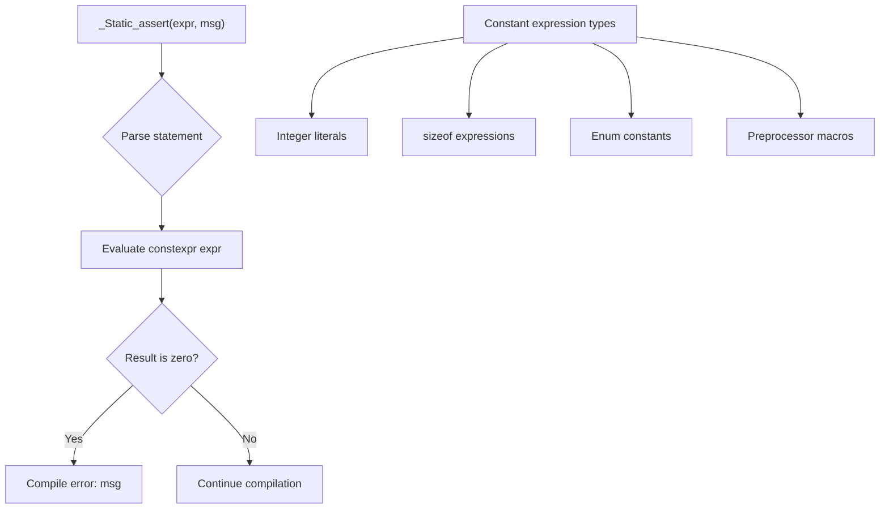

# Lesson 0044: _Static_assert (C11)

## Status: 📋 Planned | Phase: Float & Advanced | Effort: Easy (2-3h)

## Objective

Implement compile-time assertions.

## Static Assert Processing

## Implementation Checklist

- [ ] Parse `_Static_assert(constexpr, "message")`
- [ ] Evaluate constant expression at compile time
- [ ] Report error with message if assertion fails
- [ ] Test: `_Static_assert(1, "always passes");`
- [ ] Test: `_Static_assert(0, "fails");` → compile error
