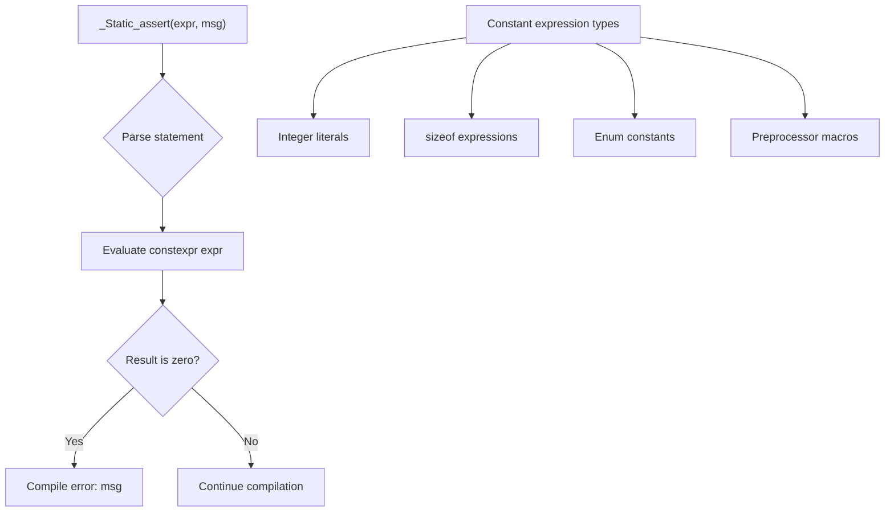

# Lesson 0044: _Static_assert (C11)

## Status: ✅ Complete (with caveat) | Phase: Float & Advanced | Effort: Easy (2-3h)

## Objective

Implement compile-time assertions. The parser accepts the
`_Static_assert(constant-expression, "message")` syntax; the
condition expression is parsed and discarded, and the message
string is also discarded. The assertion is **never evaluated** —
the compiler always passes.

## Static Assert Processing



## Implementation Checklist

- [x] Parse `_Static_assert(constexpr, "message")`
- [x] Accept the message string (currently ignored)
- [x] Test: `_Static_assert(1, "always passes");`
- [ ] Test: `_Static_assert(0, "fails");` — **does NOT produce
      an error** (see Status)

## Implementation Details

The core trick: the entire `_Static_assert` is recognised and
**turned into a no-op `ExprStmtNode`**. The condition
expression is parsed (and any type-checking / constant
folding would happen on it) but never evaluated at compile
time.

### Parser — skip both arguments

`parse_static_assert()` consumes `_Static_assert`, the `(`,
the condition expression, the optional comma+string, the
`)` and the `;`, and returns an empty `ExprStmtNode`
(`src/parser.cpp:1366-1381`):

```cpp
// src/parser.cpp:1366-1381
ASTPtr Parser::parse_static_assert() {
    int line = peek().line;
    int col = peek().column;
    advance(); // consume _Static_assert

    expect(TokenType::LPAREN);
    auto condition = parse_expression();
    // Skip the message string
    if (match(TokenType::COMMA)) {
        if (check(TokenType::STRING_LITERAL)) advance();
    }
    expect(TokenType::RPAREN);
    expect(TokenType::SEMICOLON);
    // Static assertions are checked at compile time; for now skip them
    // by returning an empty expression statement
    return std::make_unique<ExprStmtNode>(line, col);
}
```

The `condition` AST node is created and immediately
discarded. The local `condition` variable goes out of scope
without being used.

`parse_statement()` routes the keyword to this function
(`src/parser.cpp:1069-1071`):

```cpp
// src/parser.cpp:1069-1071
if (check(TokenType::KW_STATIC_ASSERT)) {
    return parse_static_assert();
}
```

The keyword is also recognised as the `static_assert` alias
(`src/lexer.cpp:140-141`).

## Example

```c
// src/example.c
_Static_assert(sizeof(int) == 4, "int must be 4 bytes");
int main() { return 0; }
```

The parser sees `_Static_assert`, parses `(sizeof(int) == 4, "...")`, and
produces an `ExprStmtNode` carrying no code. The codegen
emits the `main` body normally. The compiler exits 0.

```c
_Static_assert(0, "this would fail in a real compiler");
```

…also exits 0. The condition is never inspected.

## Source Code References

| Component | File | Lines | Description |
|-----------|------|-------|-------------|
| `_Static_assert` token | `src/lexer.cpp` | `140` | Maps to `TokenType::KW_STATIC_ASSERT` |
| `static_assert` alias | `src/lexer.cpp` | `141` | Same token type |
| Parser dispatch | `src/parser.cpp` | `1069-1071` | Routes to `parse_static_assert` |
| `parse_static_assert` | `src/parser.cpp` | `1366-1381` | Skips both arguments, returns no-op |
| `ExprStmtNode` AST | `src/ast.h` | `356-361` | Statement wrapper that emits no code |
| `KW_STATIC_ASSERT` enum | `src/token.h` | `57` | Token type |
| `KW_GENERIC` enum (sibling) | `src/token.h` | `58` | See lesson 0045 |

## Status

- **Lexer / Parser**: ✅ Both `_Static_assert` and
  `static_assert` are recognised; the message string is
  accepted and ignored.
- **Note (no evaluation)**: ⚠️ The condition is **never
  evaluated**. `_Static_assert(0, "fails")` compiles
  successfully. The compiler will not catch mismatched
  assumptions about types, sizes, or preprocessor values at
  this point. If your code relies on `_Static_assert` for
  safety, this is a gap.
