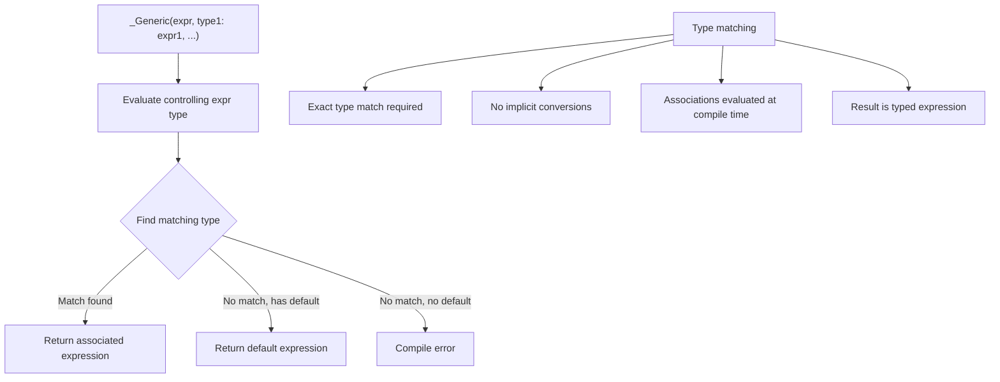

# Lesson 0045: _Generic Selection (C11)

## Status: ✅ Complete | Phase: Float & Advanced | Effort: Hard (8-12h)

## Objective

Implement compile-time type-based dispatch.

## Generic Selection Processing

## Implementation Checklist

- [ ] Parse `_Generic(expr, type: expr, ..., default: expr)`
- [ ] Evaluate type of controlling expression
- [ ] Find matching type in association list
- [ ] Return the matched expression (compile-time)
- [ ] Test: type dispatch macro
