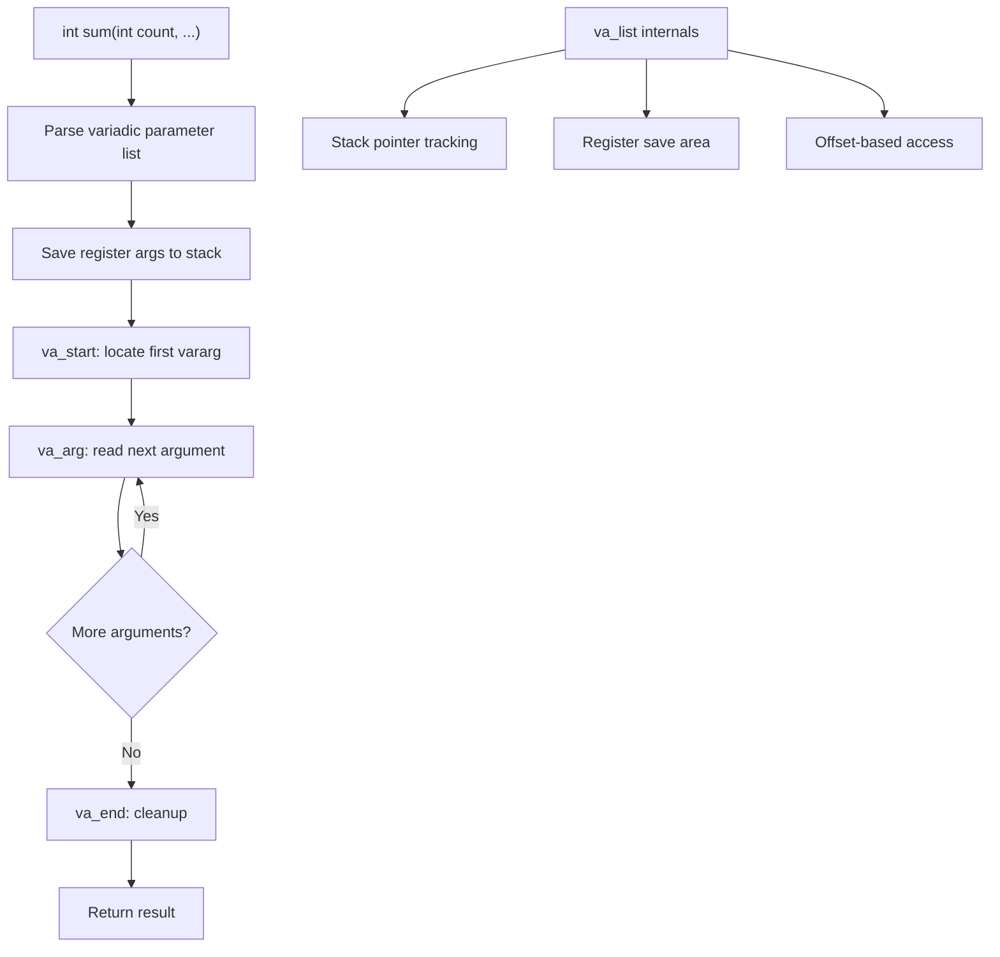

# Lesson 0046: Variadic Functions

## Status: ✅ Complete | Phase: Float & Advanced | Effort: Hard (12-16h)

## Objective

Implement functions with variable number of arguments.

## Variadic Function Processing

## Implementation Checklist

- [ ] Parse `...` in parameter list
- [ ] Parse `va_list`, `va_start`, `va_arg`, `va_end`
- [ ] Save register arguments to stack
- [ ] Implement `va_start`, `va_arg`, `va_end`
- [ ] Test: implement `sum(int count, ...)` function
- [ ] Test: implement basic `printf`-like function
