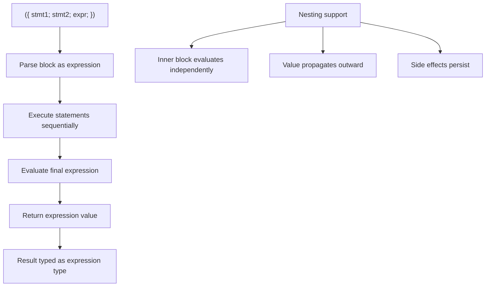

# Lesson 0047: Statement Expressions (GCC Extension)

## Status: 📋 Planned | Phase: Float & Advanced | Effort: Medium (4-6h)

## Objective

Implement `{ stmt; expr; }` compound expressions.

## Statement Expression Processing

## Implementation Checklist

- [ ] Parse `{ stmts...; expr; }` as expression
- [ ] Execute statements, return last expression value
- [ ] Support nesting
- [ ] Test: `int x = ({ int a = 1; a + 1; });` → 2
