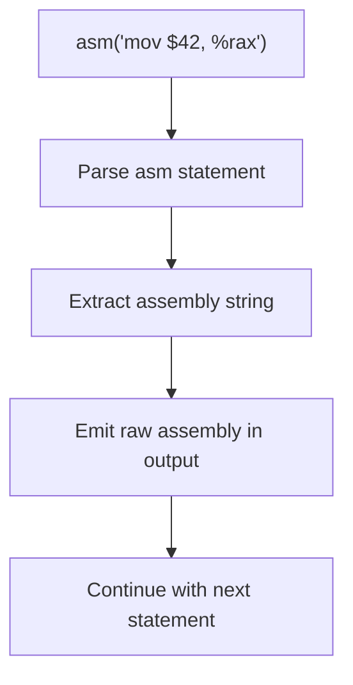

# Lesson 0048: Inline Assembly

## Status: ⚠️ Partial | Phase: Float & Advanced | Effort: Medium (6-8h)

## Objective

Implement `asm("instruction")` for inline assembly — pass assembly text directly through to the generated `.s` file.

## Syntax

```c
// Basic form
asm("mov $42, %rax");

// Volatile form
asm volatile("nop");

// Extended form (operands parsed but not used)
asm("mov %1, %0" : "=r"(result) : "r"(input) : "eax");
```

## Implementation

The compiler recognizes `asm` (or `__asm__`) as a statement-level construct. The string literal is extracted and emitted verbatim into the output assembly file.

A dedicated `AsmStmtNode` AST node holds the assembly text. The codegen `visitAsmStmtNode` writes the text directly to the output stream.

## Limitations

- **No operand binding.** Extended asm syntax `asm("..." : "=r"(x) : "r"(y) : "eax")` is parsed but the constraint strings, expressions, and clobber lists are skipped. The output assembly contains only the body string.
- **No register allocation.** The user is responsible for `%rax`, `%rdi`, etc. in their asm text.
- **No clobber tracking.** Caller-saved registers not marked clobbered.
- **No `goto` labels in asm.**

## Inline Assembly Processing



## Example

```c
int main() {
    asm("mov $42, %rax");
    return 0;  // would return 42 in %rax
}
```

## Source Code References

| Component | File | Description |
|-----------|------|-------------|
| AST node | `src/ast.h` | `AsmStmtNode` |
| Parser | `src/parser.cpp` | `parse_statement` handles `asm`/`__asm__` |
| Codegen | `src/codegen.cpp` | `visitAsmStmtNode` emits raw text |
