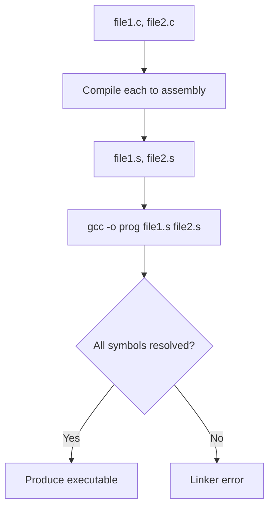

# Lesson 0049: Multi-File Compilation

## Status: ✅ Complete | Phase: System Integration | Effort: Medium

## Objective

Support separate compilation and linking: `simplecc` can compile several
`.c` files to assembly, and the resulting assembly text can be assembled
and linked by `gcc`/`ld` into a single executable. The library does not
maintain cross-file symbol state during a single `compile()` call — the
assembler and linker do that.

## Multi-File Flow



## API

`Compiler::compile_files` (`src/compiler.cpp:97-122`) iterates the input
files, calls `compile_file` for each, and concatenates the assembly
output. The driver's `main.cpp:64-65` uses this entry point when more
than one input is given on the command line.

```cpp
// src/compiler.cpp:97-122
MultiFileCompileResult Compiler::compile_files(
    const std::vector<std::string>& filenames) {
    MultiFileCompileResult result;
    result.success = true;
    std::string combined_assembly;
    for (const auto& filename : filenames) {
        auto file_result = compile_file(filename);
        if (!file_result.success) {
            result.success = false;
            result.error_message = file_result.error_message;
            result.error_filename = filename;
            result.error_line = file_result.error_line;
            return result;
        }
        if (!combined_assembly.empty()) combined_assembly += "\n";
        combined_assembly += file_result.assembly;
    }
    result.combined_assembly = combined_assembly;
    return result;
}
```

## `extern` and Forward Declarations

A translation unit can call functions defined in another file by declaring
them with `extern` (or by forward-declaring with no body). The parser
handles both:

- `extern int helper(void);` is parsed by `parse_declaration`
  (`src/parser.cpp:300-336`) and produces a `FunctionDeclNode` with
  `body == nullptr`. The codegen (`src/codegen.cpp:305-309`) skips such
  forward declarations.
- `int add(int, int);` followed later in the same file by the full
  definition is parsed by `parse_function_decl`
  (`src/parser.cpp:578-615`); when the parser sees the trailing
  `;` without a body, it sets `body = nullptr` and returns the
  forward declaration.

The first definition of a symbol is emitted with a `.globl` directive
(generated by `emit_function_prologue` at `src/codegen.cpp:98-99` and
`emit_label` for globals at `src/codegen.cpp:60-61`). Subsequent
declarations of the same name are not re-emitted.

## Limitations

- The compiler does not implement a linker. Symbol resolution is performed
  by `gcc` (or `ld`) at link time. The `simplecc` driver concatenates the
  per-file assembly text and writes it to a single output file; it does
  not call the linker itself.
- No separate-object (`.o`) pipeline. `simplecc` produces flat assembly
  text per file, not relocatable object files.
- `static` linkage is honoured (`src/codegen.cpp:50-65` skips `.globl` for
  `is_extern` and for `static` symbols are tracked in the semantic table
  at `src/semantic.cpp:246`).
- The semantic analyzer tracks `is_static` / `is_extern` per symbol
  (`src/semantic.h:27-28`) but does not enforce One-Definition-Rule across
  files; the linker is the final arbiter.

## Example

```c
// file1.c
int helper() { return 42; }

// file2.c
extern int helper();
int main() { return helper(); }   // returns 42
```

Compile + link:

```sh
./build/simplecc -S file1.c file2.c -o combined.s
gcc -o prog combined.s
./prog   # exit code 42
```

## Source Code References

| Component | File:Line | Description |
|-----------|-----------|-------------|
| `compile_files` | `src/compiler.cpp:97-122` | Multi-file driver: iterates inputs, concatenates assembly |
| `main.cpp` driver | `src/main.cpp:64-65` | Calls `compile_files` for multi-input invocations |
| `parse_declaration` | `src/parser.cpp:300-336` | Handles `extern` and the `body == nullptr` forward-decl path |
| `parse_function_decl` | `src/parser.cpp:578-615` | Distinguishes forward decls from full definitions |
| Codegen forward-decl skip | `src/codegen.cpp:305-309` | Skips emission when `body == nullptr` |
| Global emission | `src/codegen.cpp:50-65` | Emits `.globl` per non-`extern` global |
| `is_static` | `src/semantic.cpp:246` | Tracks `static` per symbol |
