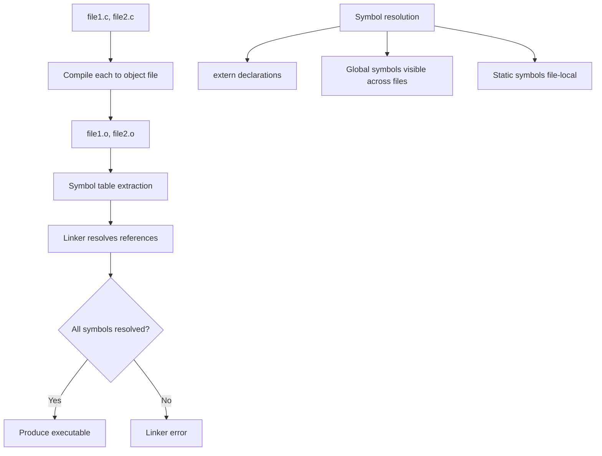

# Lesson 0049: Multi-File Compilation

## Status: 📋 Planned | Phase: System Integration | Effort: Medium (8-12h)

## Objective

Implement separate compilation and linking.

## Multi-File Compilation Flow

## Implementation Checklist

- [ ] Compile each `.c` file to `.o` object file
- [ ] Support `-c` flag for compile-only
- [ ] Link multiple `.o` files
- [ ] Symbol resolution across files
- [ ] Test: split program into 2 files, compile and link
