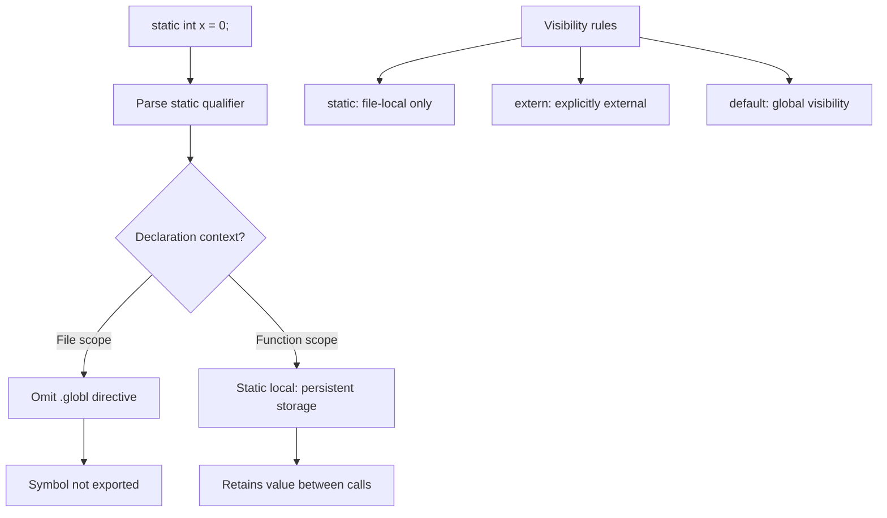

# Lesson 0050: Static Linkage

## Status: ✅ Complete | Phase: System Integration | Effort: Easy (2-3h)

## Objective

Implement `static` for file-local symbols.

## Static Linkage Processing

## Implementation Checklist

- [ ] Parse `static` on functions and variables
- [ ] Omit `.globl` for static symbols
- [ ] Static local variables (persistent)
- [ ] Test: `static void helper() {}` not visible outside file
