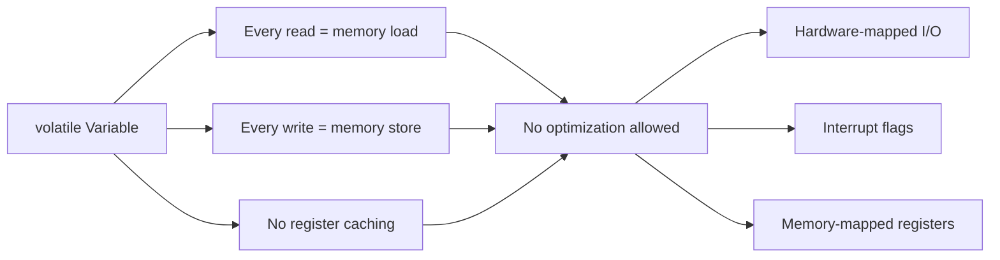
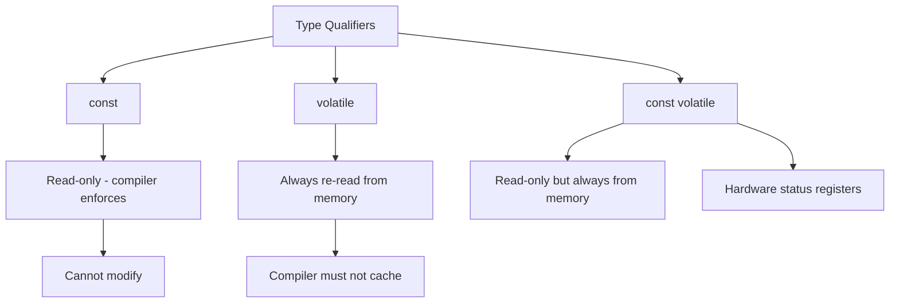

# Lesson 0051: volatile Qualifier

## Status: 📋 Planned | Phase: System Integration | Effort: Easy (2-3h)

## Objective

Implement `volatile` to prevent optimization on memory accesses.

## volatile Qualifier Behavior

## volatile vs const

## Implementation Checklist

- [ ] Parse `volatile` keyword
- [ ] Disable register caching for volatile reads
- [ ] Generate memory load/store for every volatile access
- [ ] Test: volatile read generates memory load every iteration
