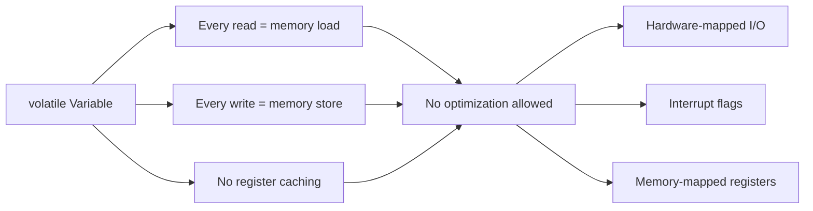
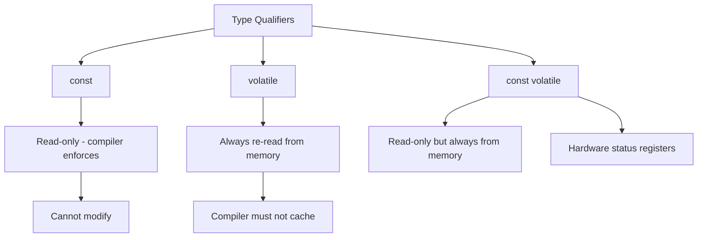

# Lesson 0051: volatile Qualifier

## Status: 📋 Planned | Phase: System Integration | Effort: Easy (2-3h)

## Objective

Implement `volatile` to prevent optimization on memory accesses.

## volatile Qualifier Behavior

## volatile vs const

## Implementation Checklist

- [ ] Parse `volatile` keyword
- [ ] Disable register caching for volatile reads
- [ ] Generate memory load/store for every volatile access
- [ ] Test: volatile read generates memory load every iteration

## Implementation Details

The `volatile` qualifier is implemented across the lexer, token definitions, and parser. The compiler recognizes `volatile` as a type qualifier and parses it alongside `const`, `static`, and `extern`.

| Component | File | Line | Description |
|-----------|------|------|-------------|
| Token type | `src/token.h` | 49 | `KW_VOLATILE` enum value definition |
| Token name | `src/lexer.cpp` | 38 | Maps `KW_VOLATILE` to string `"volatile"` |
| Keyword map | `src/lexer.cpp` | 122 | Registers `"volatile"` as `KW_VOLATILE` keyword |
| Type specifier | `src/parser.cpp` | 73 | Recognizes `KW_VOLATILE` in `is_type_specifier()` |
| Qualifier parse | `src/parser.cpp` | 94-95 | Parses `volatile` keyword and appends to type string |
| Type string | `src/parser.cpp` | 87-105 | `parse_type_specifier()` handles qualifiers in any order |
| Test coverage | `tests/test_volatile_qualifier.cpp` | 1-87 | Tests volatile int, volatile pointer, const volatile |
