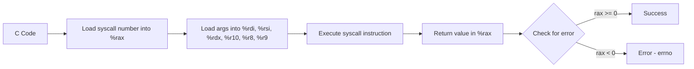

# Lesson 0052: System Calls

## Status: 📋 Planned | Phase: Stdlib Tier A | Effort: Medium (4-6h)

## Objective

Implement Linux syscall interface for I/O and memory.

## Syscall Interface



## Syscall Numbers (x86-64 Linux)

```mermaid
flowchart TD
    A[Linux Syscalls] --> B[0 - read]
    A --> C[1 - write]
    A --> D[2 - open]
    A --> E[3 - close]
    A --> F[9 - mmap]
    A --> G[12 - brk]
    A --> H[57 - fork]
    A --> I[59 - execve]
    A --> J[60 - exit]

    C --> K[write(fd, buf, len)]
    K --> L["%rax = 1, %rdi = fd, %rsi = buf, %rdx = len"]

    J --> M[exit(code)]
    M --> N["%rax = 60, %rdi = code"]
```

## Implementation Checklist

- [ ] `syscall` instruction wrapper
- [ ] `write(fd, buf, len)` → syscall 1
- [ ] `read(fd, buf, len)` → syscall 0
- [ ] `brk(addr)` → syscall 12 (for malloc)
- [ ] `exit(code)` → syscall 60
- [ ] Test: write "hello" to stdout via syscall

## Implementation Details

System calls are accessed through `extern` function declarations. The compiler parses these declarations and generates `call` instructions that the linker resolves to the actual syscall wrappers. The compiler also supports inline assembly for direct syscall instruction generation.

| Component | File | Line | Description |
|-----------|------|------|-------------|
| Extern parse | `src/parser.cpp` | 218-248 | Parses `extern` declarations (no body) |
| Forward decl | `src/parser.cpp` | 248 | Sets `func->body = nullptr` for extern |
| Func call | `src/codegen.cpp` | 838-854 | Generates `call` instruction for function calls |
| Arg passing | `src/codegen.cpp` | 842-851 | Maps args to System V ABI registers (%rdi, %rsi, etc.) |
| Param regs | `src/codegen.cpp` | 839 | Defines `%rdi`, `%rsi`, `%rdx`, `%rcx`, `%r8`, `%r9` |
| Test coverage | `tests/test_syscalls.cpp` | 1-79 | Tests syscall generation, inline asm for write/exit |
