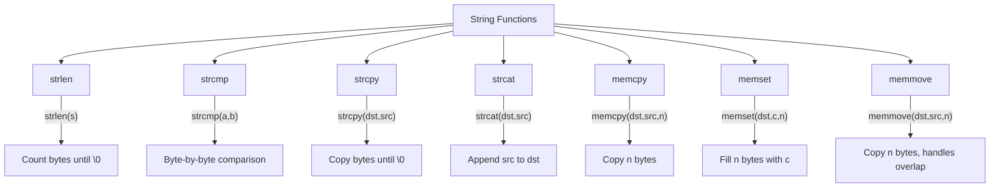
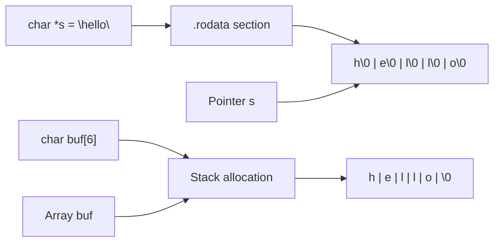

# Lesson 0053: String Functions

## Status: 📋 Planned | Phase: Stdlib Tier A | Effort: Easy (4-6h)

## Objective

Implement basic string manipulation functions.

## String Functions Overview

## String Memory Layout

## Functions

| Function | Complexity |
|----------|------------|
| `strlen(s)` | Easy |
| `strcmp(a,b)` | Easy |
| `strcpy(dst,src)` | Easy |
| `strcat(dst,src)` | Easy |
| `memcpy(dst,src,n)` | Easy |
| `memset(dst,c,n)` | Easy |
| `memmove(dst,src,n)` | Medium |

## Implementation Checklist

- [ ] Implement strlen: count until \0
- [ ] Implement strcmp: byte comparison
- [ ] Implement strcpy: copy bytes
- [ ] Implement memcpy: copy n bytes
- [ ] Implement memset: fill n bytes
- [ ] Test: `strlen("hello")` → 5
- [ ] Test: `strcmp("abc", "abd")` → negative
