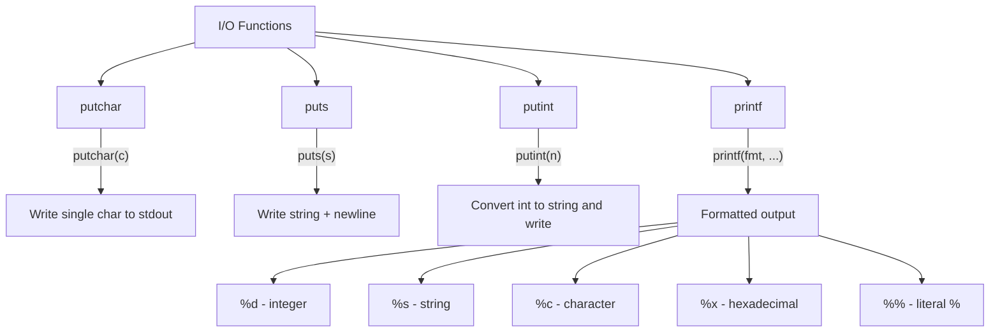

# Lesson 0054: I/O Functions

## Status: 📋 Planned | Phase: Stdlib Tier A | Effort: Medium (8-12h)

## Objective

Implement printf, puts, putchar, and basic I/O.

## I/O Functions Overview



## printf Format String Parsing

```mermaid
flowchart LR
    A["printf(\"hi %d %s\\n\", 42, \"wow\")"] --> B[Parse format string]
    B --> C[Output: hi ]
    C --> D["%d → 42"]
    D --> E[Output:  ]
    E --> F["%s → wow"]
    F --> G[Output: \n]
    G --> H["Final: hi 42 wow\n"]
```

## Functions

| Function | Complexity |
|----------|------------|
| `putchar(c)` | Trivial |
| `puts(s)` | Easy |
| `putint(n)` | Easy |
| `printf(fmt, ...)` | Hard |

## Implementation Checklist

- [ ] Implement putchar via write syscall
- [ ] Implement puts (string + newline)
- [ ] Implement putint (int to string conversion)
- [ ] Implement printf with `%d`, `%s`, `%c`, `%x`
- [ ] Handle format string parsing
- [ ] Handle varargs
- [ ] Test: `printf("hello %s %d\n", "world", 42);`
