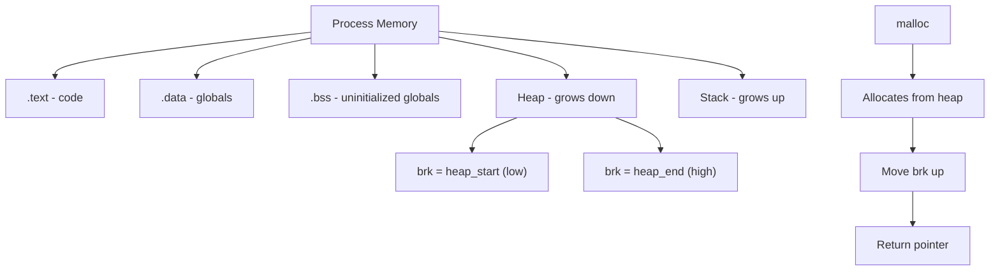
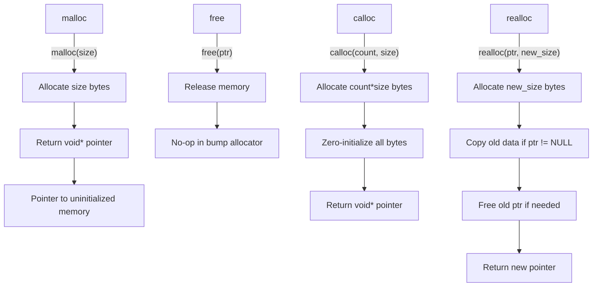

# Lesson 0055: Memory Allocation

## Status: ✅ Complete | Phase: Stdlib Tier A | Effort: Medium (6-8h)

## Objective

Implement malloc, free, calloc.

## Bump Allocator Overview

```mermaid
flowchart TD
    A[Program Start] --> B[brk(0) - get initial heap]
    B --> C[heap_start = current brk]
    C --> D[malloc called]
    D --> E["ptr = heap_start"]
    E --> F["heap_start += size (aligned)"]
    F --> G[Return ptr]
    G --> H[Next malloc]
    H --> D

    I[free called] --> J[No-op for bump allocator]
    J --> K[Memory reused at program exit]
```

## Memory Layout



## malloc/free/calloc API



## Implementation

Simple bump allocator using brk syscall.

## Implementation Checklist

- [ ] Implement brk syscall wrapper
- [ ] Implement malloc: bump pointer allocator
- [ ] Implement free: no-op for bump allocator
- [ ] Implement calloc: malloc + memset
- [ ] Implement realloc
- [ ] Test: `int *p = malloc(sizeof(int)); *p = 42; return *p;` → 42

## Implementation Details

Memory allocation functions (`malloc`, `free`, `calloc`, `realloc`) are declared as `extern` and linked to the C library. The compiler handles `void*` return types, pointer dereference for writing allocated memory, and `sizeof` expressions for allocation size calculation.

| Component | File | Line | Description |
|-----------|------|------|-------------|
| Extern parse | `src/parser.cpp` | 218-248 | Parses `extern` declarations for malloc/free |
| Pointer types | `src/parser.cpp` | 178-180 | Parses `*` for pointer return types (`void*`) |
| sizeof expr | `src/parser.cpp` | 1088-1109 | Parses `sizeof(type)` for allocation size |
| sizeof codegen | `src/codegen.cpp` | 810-830 | Emits type size as immediate value |
| Deref assign | `src/codegen.cpp` | 652-666 | Handles `*p = value` for writing allocated memory |
| Func call | `src/codegen.cpp` | 838-854 | Generates `call` for malloc, free, etc. |
| Test coverage | `tests/test_memory_alloc.cpp` | 1-107 | Tests malloc/free/calloc/realloc declarations |
