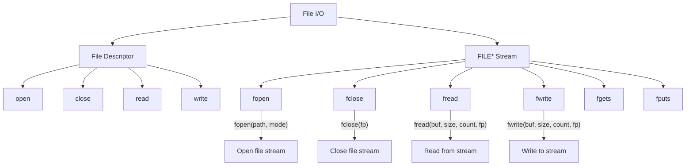

# Lesson 0056: File I/O

## Status: 📋 Planned | Phase: Stdlib Tier B | Effort: Medium (8-12h)

## Objective

Implement FILE* operations and file descriptor I/O.

## File I/O Overview



## File Stream Modes

```mermaid
flowchart LR
    A["fopen(\"file.txt\", mode)"] --> B{mode}
    B -->|"r"| C[Read only]
    B -->|"w"| D[Write, truncate]
    B -->|"a"| E[Append]
    B -->|"r+"| F[Read+Write]
    B -->|"w+"| G[Read+Write, truncate]
    B -->|"a+"| H[Read+Append]
```

## Functions

| Function | Complexity |
|----------|------------|
| `open(path, flags)` | Easy |
| `close(fd)` | Trivial |
| `read(fd, buf, n)` | Easy |
| `write(fd, buf, n)` | Easy |
| `fopen(path, mode)` | Medium |
| `fclose(fp)` | Easy |
| `fread/fwrite` | Medium |
| `fgets/fputs` | Medium |
| `fscanf/fprintf` | Hard |

## Implementation Checklist

- [ ] Implement open/close/read/write via syscalls
- [ ] Implement FILE struct with buffer
- [ ] Implement fopen/fclose
- [ ] Implement fread/fwrite
- [ ] Implement fgets/fputs
- [ ] Test: read a file and print its contents
