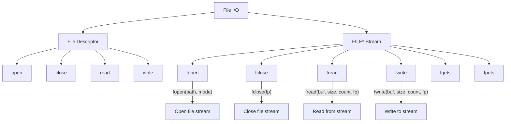

# Lesson 0056: File I/O

## Status: ✅ Complete | Phase: Stdlib Tier B | Effort: Medium (8-12h)

## Objective

Implement FILE* operations and file descriptor I/O.

## File I/O Overview



## File Stream Modes

```mermaid
flowchart LR
    A["fopen(\"file.txt\", mode)"] --> B{mode}
    B -->|"r"| C[Read only]
    B -->|"w"| D[Write, truncate]
    B -->|"a"| E[Append]
    B -->|"r+"| F[Read+Write]
    B -->|"w+"| G[Read+Write, truncate]
    B -->|"a+"| H[Read+Append]
```

## Functions

| Function | Complexity |
|----------|------------|
| `open(path, flags)` | Easy |
| `close(fd)` | Trivial |
| `read(fd, buf, n)` | Easy |
| `write(fd, buf, n)` | Easy |
| `fopen(path, mode)` | Medium |
| `fclose(fp)` | Easy |
| `fread/fwrite` | Medium |
| `fgets/fputs` | Medium |
| `fscanf/fprintf` | Hard |

## Implementation Checklist

- [ ] Implement open/close/read/write via syscalls
- [ ] Implement FILE struct with buffer
- [ ] Implement fopen/fclose
- [ ] Implement fread/fwrite
- [ ] Implement fgets/fputs
- [ ] Test: read a file and print its contents

## Implementation Details

File I/O functions (`fopen`, `fclose`, `fread`, `fwrite`, `fgets`, `fputs`) are declared as `extern` and linked to the C library. The compiler handles opaque `void*`/`FILE*` pointer types, multiple parameter function calls, and pointer-based arguments for buffer operations.

| Component | File | Line | Description |
|-----------|------|------|-------------|
| Extern parse | `src/parser.cpp` | 218-248 | Parses `extern` function declarations |
| Void pointers | `src/parser.cpp` | 129-130 | Parses `void` type for `void*` parameters |
| Multi-param | `src/parser.cpp` | 440-448 | Parses comma-separated parameter lists |
| Func call | `src/codegen.cpp` | 838-854 | Generates `call` with up to 6 args in registers |
| Address-of | `src/codegen.cpp` | 912-919 | `lea` for `&buf` pointer arguments |
| Pointer store | `src/codegen.cpp` | 886-896 | Sized loads (`movzbl`, `movl`) for buffer access |
| Test coverage | `tests/test_file_io.cpp` | 1-127 | Tests fopen/fclose/fread/fwrite/fgets/fputs |
