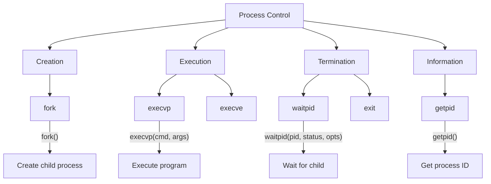
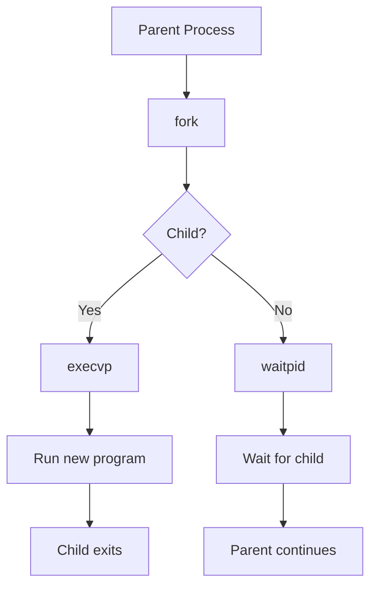

# Lesson 0057: Process Control

## Status: 📋 Planned | Phase: Stdlib Tier B | Effort: Medium (8-12h)

## Objective

Implement fork, exec, wait for process management.

## Process Control Overview

## Fork and Exec Flow

## Functions

| Function | Complexity |
|----------|------------|
| `fork()` | Medium |
| `execvp(cmd, args)` | Medium |
| `waitpid(pid, status, opts)` | Medium |
| `getpid()` | Easy |
| `exit(status)` | Trivial |

## Implementation Checklist

- [ ] Implement fork via syscall 57
- [ ] Implement execve via syscall 59
- [ ] Implement wait4 via syscall 61
- [ ] Implement getpid via syscall 39
- [ ] Test: fork and exec ls
