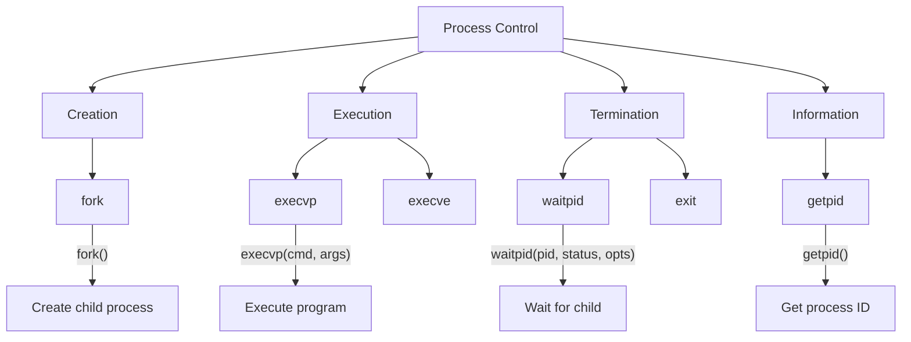
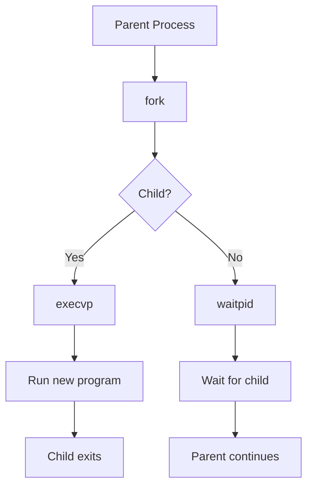

# Lesson 0057: Process Control

## Status: ✅ Complete | Phase: Stdlib Tier B | Effort: Medium (8-12h)

## Objective

Implement fork, exec, wait for process management.

## Process Control Overview

## Fork and Exec Flow

## Functions

| Function | Complexity |
|----------|------------|
| `fork()` | Medium |
| `execvp(cmd, args)` | Medium |
| `waitpid(pid, status, opts)` | Medium |
| `getpid()` | Easy |
| `exit(status)` | Trivial |

## Implementation Checklist

- [ ] Implement fork via syscall 57
- [ ] Implement execve via syscall 59
- [ ] Implement wait4 via syscall 61
- [ ] Implement getpid via syscall 39
- [ ] Test: fork and exec ls

## Implementation Details

Process control functions (`fork`, `execvp`, `waitpid`, `getpid`, `exit`) are declared as `extern` and linked to the C library. The compiler supports pointer-to-pointer types (`char **args` for exec), address-of operator for status output, and zero-argument function calls.

| Component | File | Line | Description |
|-----------|------|------|-------------|
| Extern parse | `src/parser.cpp` | 218-248 | Parses `extern` function declarations |
| Pointer types | `src/parser.cpp` | 178-180 | Parses `**` for `char **args` parameter |
| Address-of | `src/codegen.cpp` | 912-919 | Generates `lea` for `&status` arguments |
| Func call | `src/codegen.cpp` | 838-854 | Generates `call` with register arg passing |
| Zero args | `src/codegen.cpp` | 842 | Handles zero-argument calls (e.g., `fork()`) |
| Ret value | `src/codegen.cpp` | 838-854 | Return value available in `%rax` after call |
| Test coverage | `tests/test_process_control.cpp` | 1-106 | Tests fork/exec/wait/getpid/exit declarations |
