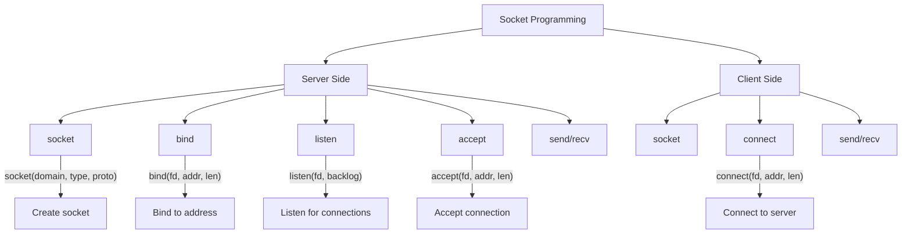
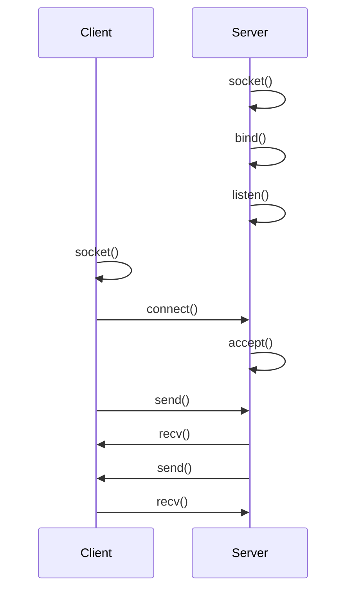

# Lesson 0058: Socket Programming

## Status: ✅ Complete | Phase: Stdlib Tier B | Effort: Medium (12-16h)

## Objective

Implement socket API for network programming.

## Socket Programming Overview

## Client-Server Flow

## Functions

| Function | Complexity |
|----------|------------|
| `socket(type, domain, proto)` | Easy |
| `bind(fd, addr, len)` | Medium |
| `listen(fd, backlog)` | Easy |
| `accept(fd, addr, len)` | Medium |
| `connect(fd, addr, len)` | Medium |
| `send/recv` | Medium |

## Implementation Checklist

- [ ] Implement socket syscall 41
- [ ] Implement bind syscall 49
- [ ] Implement listen syscall 50
- [ ] Implement accept syscall 43
- [ ] Implement connect syscall 42
- [ ] Implement send/recv
- [ ] Define sockaddr_in structure
- [ ] Test: simple TCP server that echoes messages

## Implementation Details

Socket functions (`socket`, `bind`, `listen`, `accept`, `connect`, `send`, `recv`) are declared as `extern` and linked to the C library. The compiler handles multi-parameter integer arguments for socket domain/type/protocol, `void*` for address structures, and `int*` for output parameters like `addrlen`.

| Component | File | Line | Description |
|-----------|------|------|-------------|
| Extern parse | `src/parser.cpp` | 218-248 | Parses `extern` function declarations |
| Void pointers | `src/parser.cpp` | 129-130 | Parses `void*` for `sockaddr*` arguments |
| Pointer params | `src/parser.cpp` | 601-631 | Parses `int *len` output parameters |
| Multi-param | `src/parser.cpp` | 440-448 | Parses up to 6 parameters (socket API max) |
| Func call | `src/codegen.cpp` | 838-854 | Maps socket args to %rdi, %rsi, %rdx, %r10, %r8, %r9 |
| Ret in rax | `src/codegen.cpp` | 838-854 | Socket fd returned in %rax after call |
| Test coverage | `tests/test_socket_prog.cpp` | 1-109 | Tests socket/bind/listen/accept/connect declarations |
