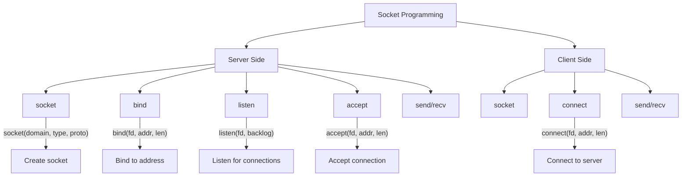
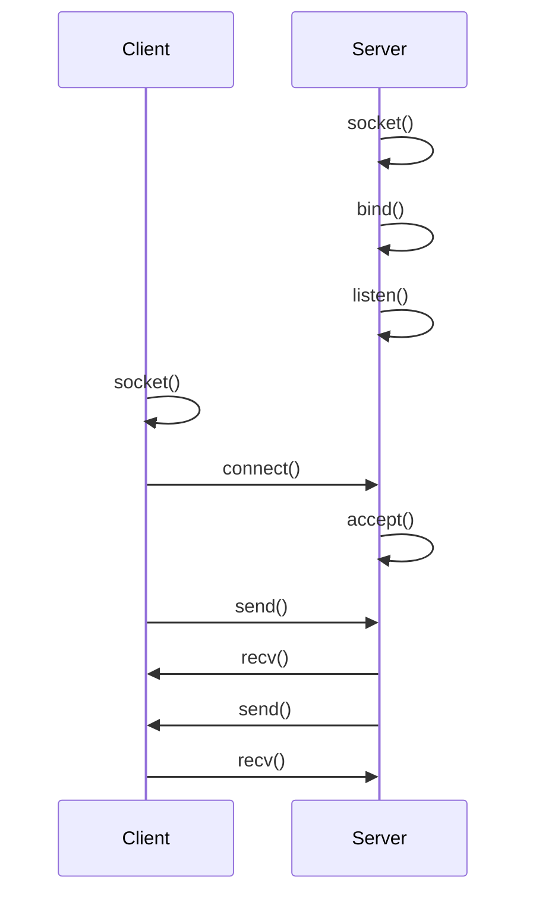

# Lesson 0058: Socket Programming

## Status: 📋 Planned | Phase: Stdlib Tier B | Effort: Medium (12-16h)

## Objective

Implement socket API for network programming.

## Socket Programming Overview

## Client-Server Flow

## Functions

| Function | Complexity |
|----------|------------|
| `socket(type, domain, proto)` | Easy |
| `bind(fd, addr, len)` | Medium |
| `listen(fd, backlog)` | Easy |
| `accept(fd, addr, len)` | Medium |
| `connect(fd, addr, len)` | Medium |
| `send/recv` | Medium |

## Implementation Checklist

- [ ] Implement socket syscall 41
- [ ] Implement bind syscall 49
- [ ] Implement listen syscall 50
- [ ] Implement accept syscall 43
- [ ] Implement connect syscall 42
- [ ] Implement send/recv
- [ ] Define sockaddr_in structure
- [ ] Test: simple TCP server that echoes messages
