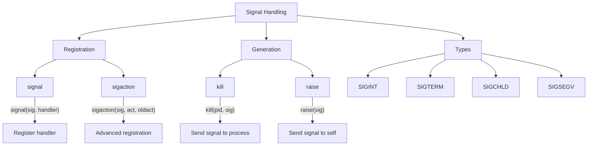
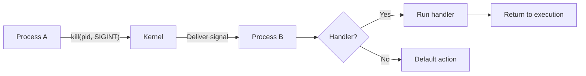

# Lesson 0059: Signal Handling

## Status: 📋 Planned | Phase: Stdlib Tier B | Effort: Medium

## Objective

Implement signal handling functions.

## Signal Handling Overview

## Signal Flow

## Functions

| Function | Complexity |
|----------|------------|
| `signal(sig, handler)` | Medium |
| `sigaction(sig, act, oldact)` | Medium |
| `kill(pid, sig)` | Easy |
| `raise(sig)` | Easy |

## Implementation Checklist

- [ ] Implement signal() via rt_sigaction syscall
- [ ] Implement sigaction() wrapper
- [ ] Implement kill() via kill syscall
- [ ] Define signal handler types
- [ ] Support SIGINT, SIGTERM, SIGCHLD
- [ ] Test: install SIGINT handler, send signal
