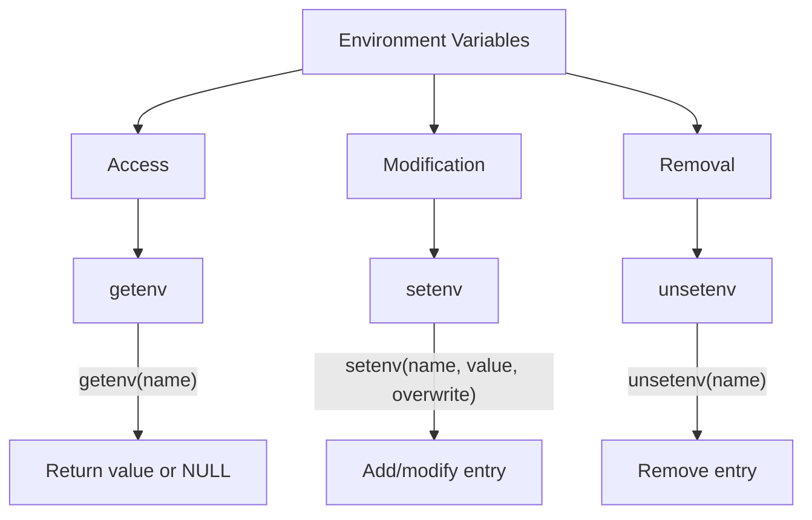

# Lesson 0060: Environment Variables

## Status: 📋 Planned | Phase: Stdlib Tier B | Effort: Easy

## Objective

Access environment variables.

## Environment Variables Overview



## Environment Variable Flow

```mermaid
flowchart LR
    A[Process] --> B[environ array]
    B --> C["KEY=VALUE pairs"]
    C --> D[HOME=/home/user]
    C --> E[PATH=/usr/bin]
    C --> F[...]
    
    G["getenv(\"HOME\")"] --> H{Found?}
    H -->|Yes| I[Return value]
    H -->|No| J[Return NULL]
```

## Functions

| Function | Complexity |
|----------|------------|
| `getenv(name)` | Easy |
| `setenv(name, value, overwrite)` | Medium |
| `unsetenv(name)` | Medium |

## Implementation Checklist

- [ ] Access `environ` global variable
- [ ] Implement getenv: search environment array
- [ ] Implement setenv: add/modify environment entry
- [ ] Implement unsetenv: remove environment entry
- [ ] Test: `getenv("HOME")` returns home directory
