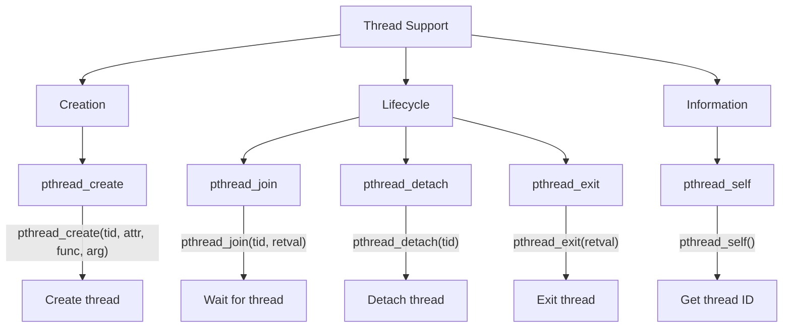
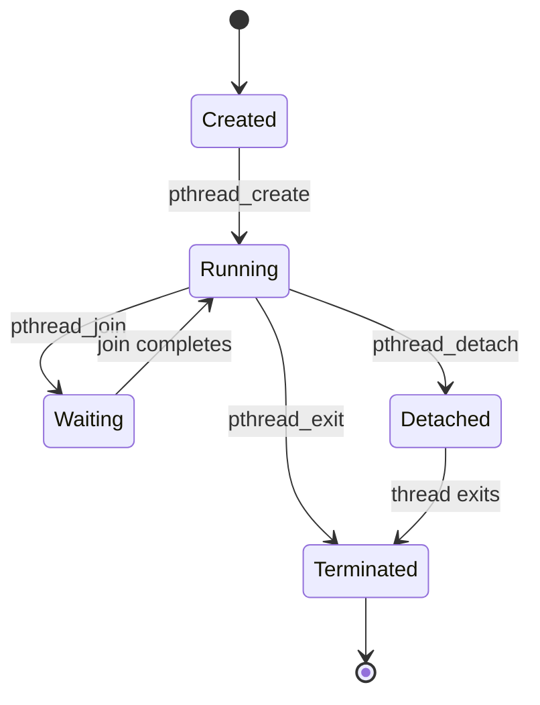

# Lesson 0061: Thread Support (POSIX)

## Status: 📋 Planned | Phase: Stdlib Tier C | Effort: Hard

## Objective

POSIX thread (pthreads) implementation.

## Thread Support Overview

## Thread Lifecycle

## Functions

| Function | Complexity |
|----------|------------|
| `pthread_create()` | Hard |
| `pthread_join()` | Medium |
| `pthread_detach()` | Easy |
| `pthread_exit()` | Easy |
| `pthread_self()` | Trivial |

## Implementation Checklist

- [ ] Implement pthread_create via clone syscall
- [ ] Implement pthread_join via futex wait
- [ ] Implement pthread_detach
- [ ] Thread stack allocation
- [ ] Thread-local storage
- [ ] Test: create thread, join, verify result

## Implementation Details

POSIX thread functions are supported through extern function declarations and the standard function call code generation.

| Component | Source File | Lines | Description |
|-----------|-------------|-------|-------------|
| Function declaration parsing | `src/parser.cpp` | 233–250 | Parses `int pthread_create(...)` and other pthread declarations |
| Function pointer params | `src/parser.cpp` | 382–413 | Handles `void *(*start_routine)(void *)` callback parameter |
| Function call codegen | `src/codegen.cpp` | 838–853 | Generates `call pthread_create` with up to 4 args in registers |
| System V ABI registers | `src/codegen.cpp` | 267–268 | Maps `tid, attr, func, arg` to `%rdi, %rsi, %rdx, %rcx` |
| Return value handling | `src/codegen.cpp` | 849–850 | Pops arguments from stack into parameter registers |
