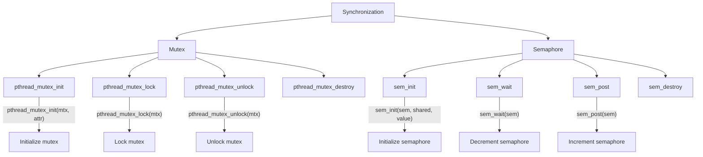
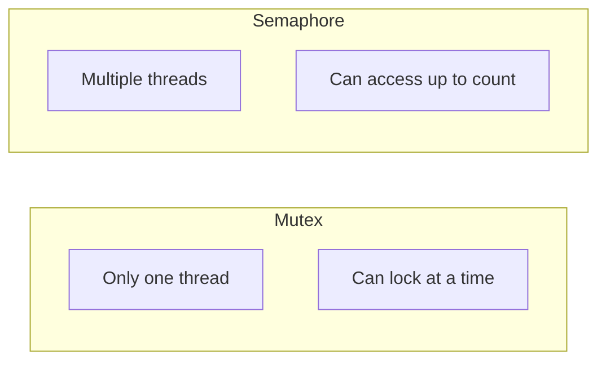

# Lesson 0062: Synchronization Primitives

## Status: 📋 Planned | Phase: Stdlib Tier C | Effort: Hard

## Objective

Mutexes, condition variables, semaphores.

## Synchronization Overview

## Mutex vs Semaphore

## Functions

| Function | Complexity |
|----------|------------|
| `pthread_mutex_init/lock/unlock/destroy` | Medium |
| `pthread_cond_init/wait/signal/broadcast/destroy` | Hard |
| `sem_init/wait/post/destroy` | Medium |

## Implementation Checklist

- [ ] Implement mutex via futex
- [ ] Implement condition variable via futex
- [ ] Implement semaphore via futex
- [ ] Spinlock implementation
- [ ] Read-write locks
- [ ] Test: producer-consumer pattern
