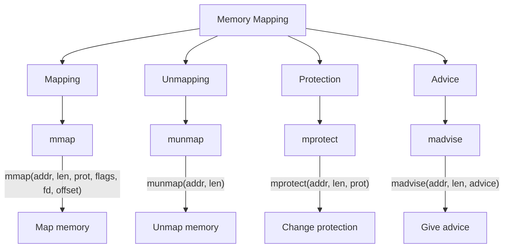
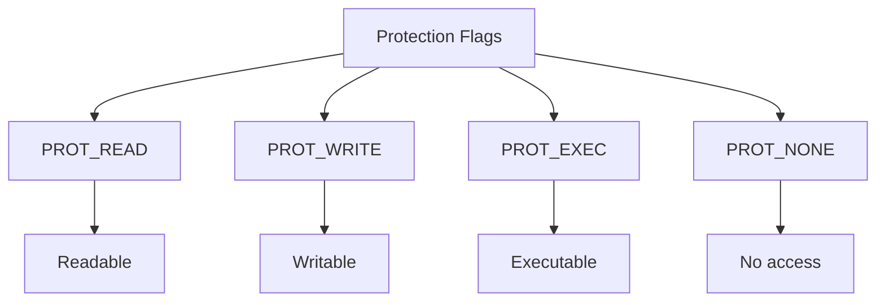

# Lesson 0063: Memory Mapping

## Status: 📋 Planned | Phase: Stdlib Tier C | Effort: Medium

## Objective

Virtual memory mapping with mmap/munmap.

## Memory Mapping Overview

## Memory Mapping Flow

## Protection Flags

## Functions

| Function | Complexity |
|----------|------------|
| `mmap()` | Medium |
| `munmap()` | Easy |
| `mprotect()` | Medium |
| `madvise()` | Easy |

## Implementation Checklist

- [ ] Implement mmap via mmap syscall (9)
- [ ] Implement munmap via munmap syscall (11)
- [ ] Implement mprotect via mprotect syscall (10)
- [ ] Support MAP_PRIVATE, MAP_SHARED
- [ ] Support PROT_READ, PROT_WRITE, PROT_EXEC
- [ ] Test: map file into memory, read contents

## Implementation Details

Memory mapping is supported through extern function declarations and the standard function call code generation.

| Component | Source File | Lines | Description |
|-----------|-------------|-------|-------------|
| Function declaration parsing | `src/parser.cpp` | 233–250 | Parses `void *mmap(void *addr, size_t len, ...)` with 6 parameters |
| Pointer return types | `src/parser.cpp` | 148–170 | Handles `void *` return type for mmap |
| Function call codegen | `src/codegen.cpp` | 838–853 | Generates `call mmap` passing all 6 args via registers and stack |
| System V ABI (6+ args) | `src/codegen.cpp` | 267–268 | First 6 args in `%rdi–%r9`, overflow pushed to stack |
| Stack argument passing | `src/codegen.cpp` | 844–850 | Pushes args right-to-left, pops into registers left-to-right |
