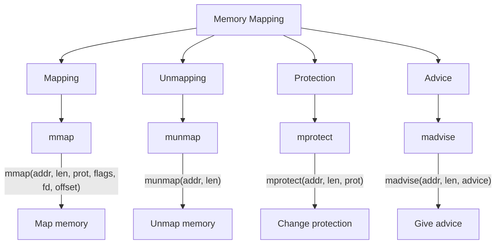
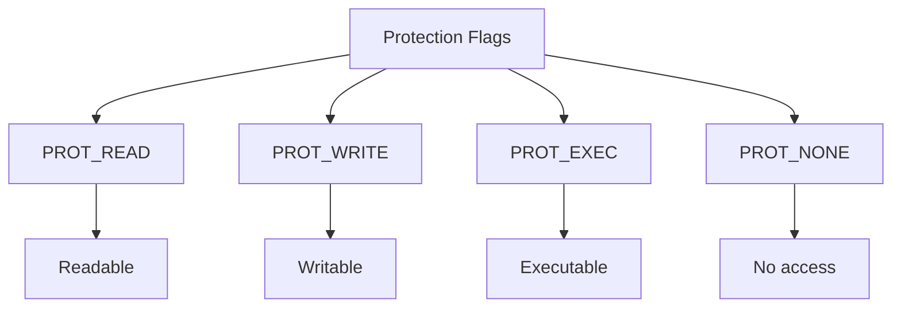

# Lesson 0063: Memory Mapping

## Status: 📋 Planned | Phase: Stdlib Tier C | Effort: Medium

## Objective

Virtual memory mapping with mmap/munmap.

## Memory Mapping Overview

## Memory Mapping Flow

## Protection Flags

## Functions

| Function | Complexity |
|----------|------------|
| `mmap()` | Medium |
| `munmap()` | Easy |
| `mprotect()` | Medium |
| `madvise()` | Easy |

## Implementation Checklist

- [ ] Implement mmap via mmap syscall (9)
- [ ] Implement munmap via munmap syscall (11)
- [ ] Implement mprotect via mprotect syscall (10)
- [ ] Support MAP_PRIVATE, MAP_SHARED
- [ ] Support PROT_READ, PROT_WRITE, PROT_EXEC
- [ ] Test: map file into memory, read contents
