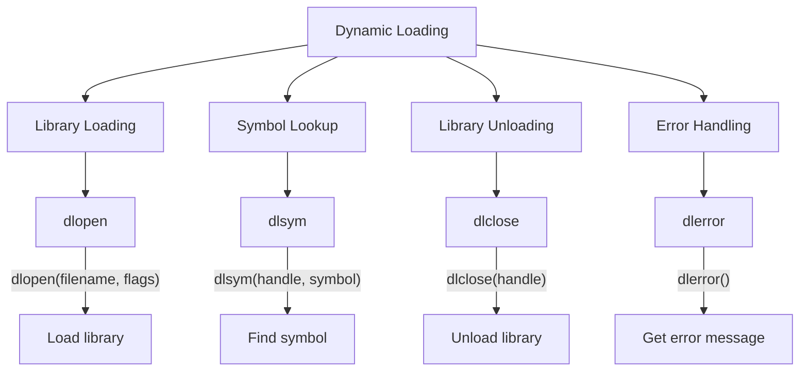
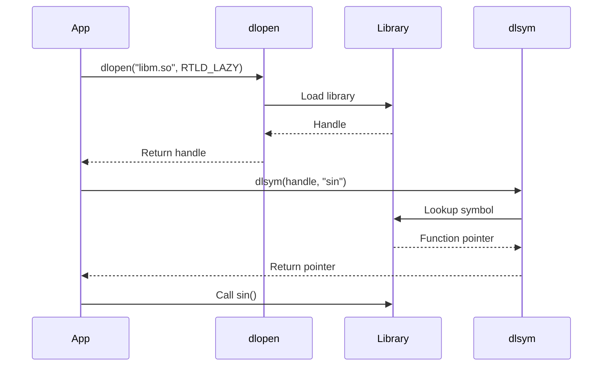

# Lesson 0064: Dynamic Loading

## Status: 📋 Planned | Phase: Stdlib Tier C | Effort: Hard

## Objective

Load shared libraries at runtime.

## Dynamic Loading Overview

## Dynamic Loading Flow

## Functions

| Function | Complexity |
|----------|------------|
| `dlopen()` | Hard |
| `dlsym()` | Hard |
| `dlclose()` | Easy |
| `dlerror()` | Easy |

## Implementation Checklist

- [ ] Implement dlopen: parse ELF, load segments
- [ ] Implement dlsym: symbol lookup
- [ ] Implement dlclose: unload library
- [ ] Implement dlerror: error reporting
- [ ] Support RTLD_LAZY, RTLD_NOW
- [ ] Test: load libm, call sin()

## Implementation Details

Dynamic loading is supported through extern function declarations and the standard function call code generation.

| Component | Source File | Lines | Description |
|-----------|-------------|-------|-------------|
| Function declaration parsing | `src/parser.cpp` | 233–250 | Parses `void *dlopen(char *path, int flags)` declarations |
| Pointer return types | `src/parser.cpp` | 148–170 | Handles `void *` return type for dlopen/dlsym handles |
| Function call codegen | `src/codegen.cpp` | 838–853 | Generates `call dlopen`/`call dlsym` with arguments |
| String argument loading | `src/codegen.cpp` | 929–935 | Loads library path string via `lea .Lstr_N(%rip), %rax` |
| Function pointer casts | `src/codegen.cpp` | 832–836 | Type cast handling for `dlsym` return value assignment |
