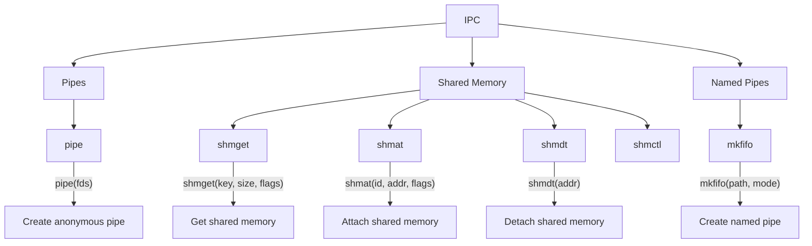
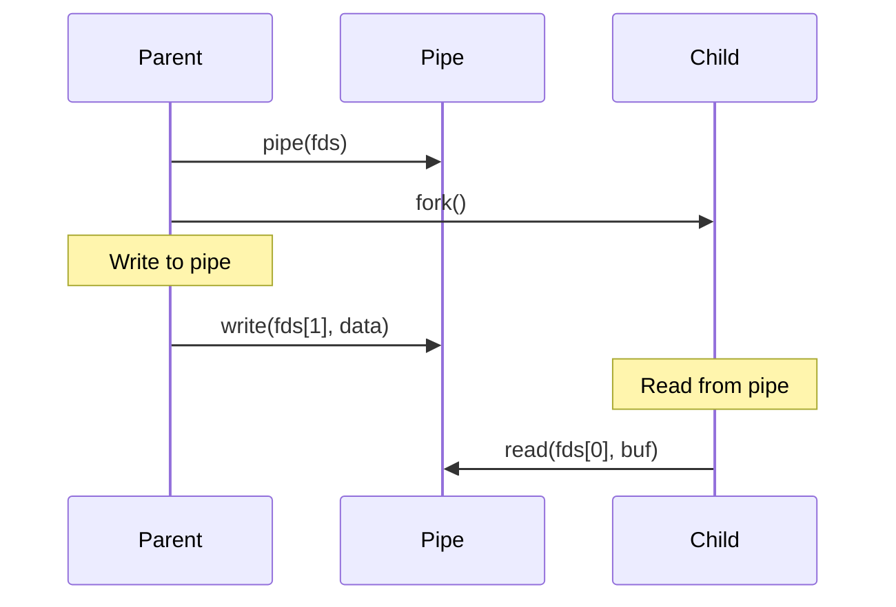
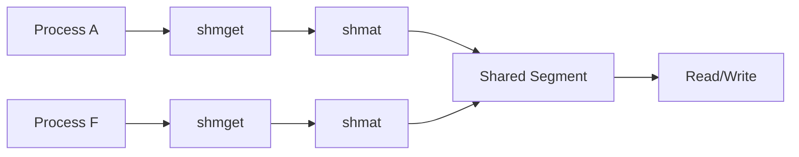

# Lesson 0065: Inter-Process Communication

## Status: 📋 Planned | Phase: Stdlib Tier C | Effort: Hard

## Objective

Pipes, shared memory, message queues.

## IPC Overview

## Pipe Communication

## Shared Memory

## Functions

| Function | Complexity |
|----------|------------|
| `pipe()` | Medium |
| `mkfifo()` | Medium |
| `shmget/shmat/shmdt/shmctl` | Hard |
| `msgget/msgsnd/msgrcv/msgctl` | Hard |

## Implementation Checklist

- [ ] Implement pipe via pipe2 syscall
- [ ] Implement FIFO via mkfifo
- [ ] Implement shared memory via shmget/shmat
- [ ] Implement message queues
- [ ] Test: parent-child communication via pipe
