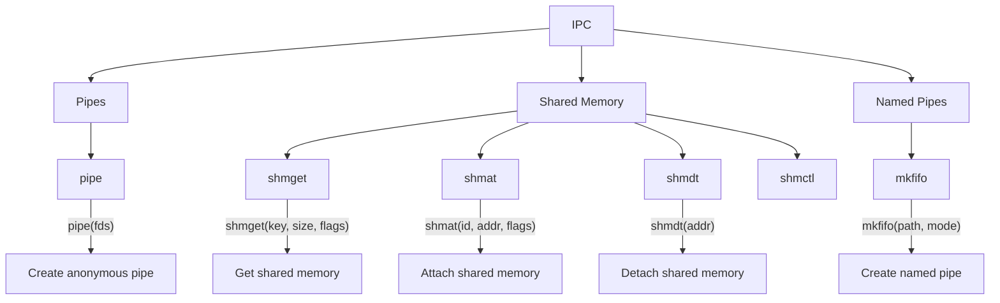
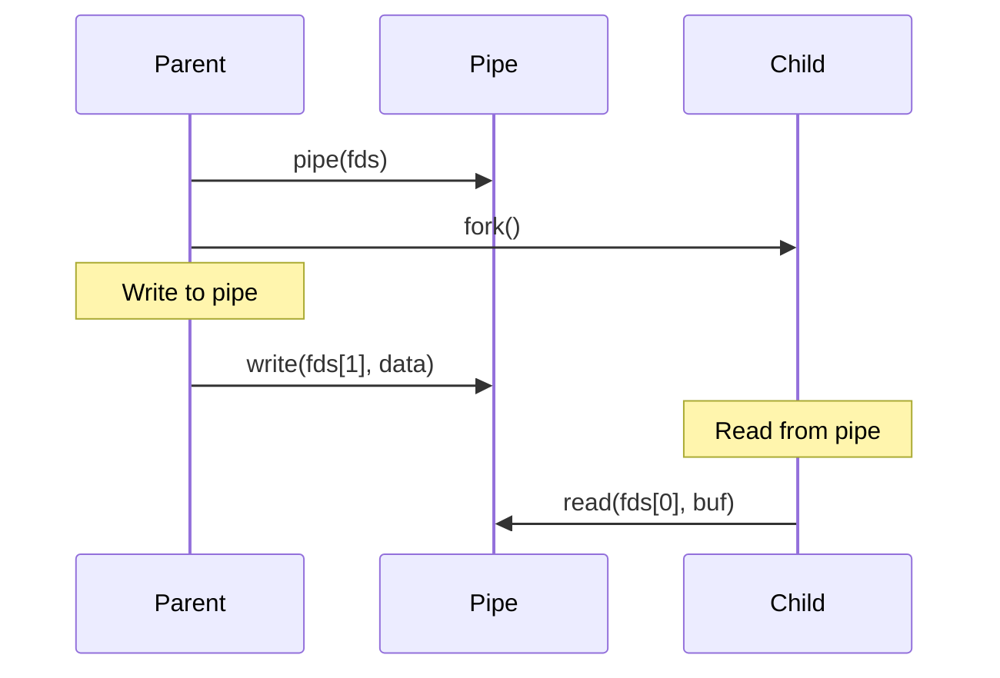
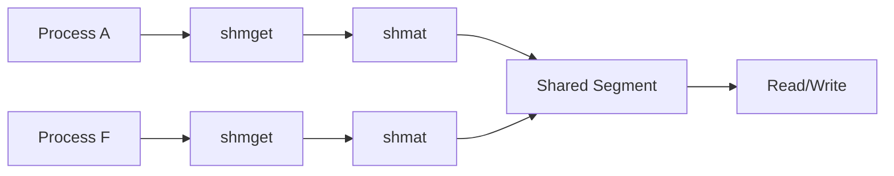

# Lesson 0065: Inter-Process Communication

## Status: 📋 Planned | Phase: Stdlib Tier C | Effort: Hard

## Objective

Pipes, shared memory, message queues.

## IPC Overview

## Pipe Communication

## Shared Memory

## Functions

| Function | Complexity |
|----------|------------|
| `pipe()` | Medium |
| `mkfifo()` | Medium |
| `shmget/shmat/shmdt/shmctl` | Hard |
| `msgget/msgsnd/msgrcv/msgctl` | Hard |

## Implementation Checklist

- [ ] Implement pipe via pipe2 syscall
- [ ] Implement FIFO via mkfifo
- [ ] Implement shared memory via shmget/shmat
- [ ] Implement message queues
- [ ] Test: parent-child communication via pipe

## Implementation Details

Inter-process communication is supported through extern function declarations and the standard function call code generation.

| Component | Source File | Lines | Description |
|-----------|-------------|-------|-------------|
| Function declaration parsing | `src/parser.cpp` | 233–250 | Parses `int pipe(int pipefd[2])` and shared memory declarations |
| Array parameter handling | `src/parser.cpp` | 148–170 | Handles array parameters `int pipefd[2]` in function signatures |
| Function call codegen | `src/codegen.cpp` | 838–853 | Generates `call pipe` with array arg passed as pointer in `%rdi` |
| Array indexing codegen | `src/codegen.cpp` | 856–895 | Generates `mov %rax, N(%rdi)` for `pipefd[0]`/`pipefd[1]` access |
| Block statement codegen | `src/codegen.cpp` | 489–492 | Sequential execution of pipe/fork/read/write calls |
