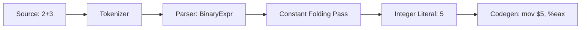

# Lesson 0066: Constant Folding

## Status: 📋 Planned | Phase: Optimization | Effort: Easy

## Objective

Evaluate constant expressions at compile time.

## Constant Folding Pipeline



## Examples

```c
// Before optimization
int x = 2 + 3;      // → int x = 5;
int y = 10 * 5 + 1; // → int y = 51;
int z = sizeof(int); // → int z = 4;

// After optimization
mov $5, %eax    # instead of add instruction
```

## Implementation Checklist

- [ ] Fold integer arithmetic: `2 + 3` → `5`
- [ ] Fold comparisons: `5 > 3` → `1`
- [ ] Fold logical operations: `1 && 1` → `1`
- [ ] Fold sizeof expressions
- [ ] Fold constant ternary: `1 ? a : b` → `a`
- [ ] Test: `return 2 + 3;` → `mov $5, %rax`

## Implementation Details

Constant folding is implemented through enum constant resolution in the parser and literal code generation in the code generator.

| Component | Source File | Lines | Description |
|-----------|-------------|-------|-------------|
| Enum constant storage | `src/parser.cpp` | 556–557 | Stores enum values in `enum_constants_` map during parsing |
| Enum constant resolution | `src/parser.cpp` | 1250–1252 | Resolves enum names to `IntegerLiteralNode` at parse time |
| Integer literal codegen | `src/codegen.cpp` | 922 | Emits `mov $N, %rax` for integer literals (folded constants) |
| Binary expression codegen | `src/codegen.cpp` | 754–772 | Generates `add`/`imul` for non-constant binary ops |
| Ternary expression codegen | `src/codegen.cpp` | 785–788 | Generates conditional branch for ternary expressions |
| Sizeof evaluation | `src/codegen.cpp` | 810–836 | Evaluates `sizeof(int)` → `mov $4, %rax` at compile time |
