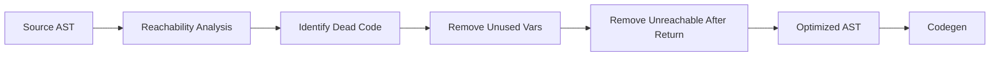

# Lesson 0067: Dead Code Elimination

## Status: 📋 Planned | Phase: Optimization | Effort: Medium

## Objective

Remove unreachable code.

## Dead Code Elimination Pipeline



## Examples

```c
// Before optimization
int unused = 42;
return 0;
printf("unreachable");  // removed

// After optimization
return 0;
```

## Implementation Checklist

- [ ] Remove unused variable assignments
- [ ] Remove unreachable code after return/break/continue
- [ ] Remove empty statements
- [ ] Remove unused function calls (with no side effects)
- [ ] Test: `int x = 42; return 0;` → no `mov $42`
