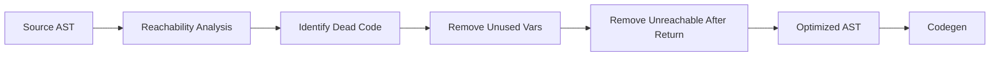

# Lesson 0067: Dead Code Elimination

## Status: 📋 Planned | Phase: Optimization | Effort: Medium

## Objective

Remove unreachable code.

## Dead Code Elimination Pipeline



## Examples

```c
// Before optimization
int unused = 42;
return 0;
printf("unreachable");  // removed

// After optimization
return 0;
```

## Implementation Checklist

- [ ] Remove unused variable assignments
- [ ] Remove unreachable code after return/break/continue
- [ ] Remove empty statements
- [ ] Remove unused function calls (with no side effects)
- [ ] Test: `int x = 42; return 0;` → no `mov $42`

## Implementation Details

Dead code elimination is implemented via a `returned_` flag in the code generator that tracks when a return statement has been emitted.

| Component | Source File | Lines | Description |
|-----------|-------------|-------|-------------|
| `returned_` flag init | `src/codegen.cpp` | 8 | Initialized to `false` in constructor |
| `returned_` reset | `src/codegen.cpp` | 263 | Reset to `false` at start of each function |
| `returned_` set on return | `src/codegen.cpp` | 504 | Set to `true` after emitting `ret` instruction |
| Skip after return | `src/codegen.cpp` | 298–301 | Checks `returned_` before dispatching statements in blocks |
| Block visitor | `src/codegen.cpp` | 489–492 | Iterates statements; dead code skipped via `returned_` check |
| Return codegen | `src/codegen.cpp` | 498–504 | Emits epilogue + `ret`, then sets `returned_ = true` |
