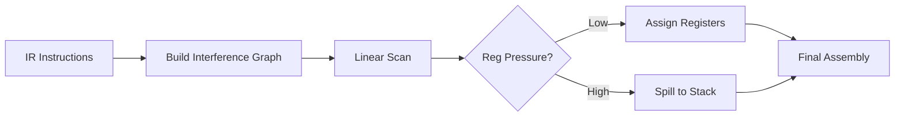

# Lesson 0068: Register Allocation

## Status: 📋 Planned | Phase: Optimization | Effort: Hard

## Objective

Minimize memory access by keeping values in registers.

## Register Allocation Pipeline



## Example

```c
// Before: stack-heavy
int a = 1;
int b = 2;
int c = a + b;
return c;

// After: register-optimized
mov $1, %eax
add $2, %eax
ret
```

## Implementation Checklist

- [ ] Linear scan register allocation
- [ ] Handle register pressure (spill to stack)
- [ ] Use callee-saved registers for locals
- [ ] Reuse registers for dead values
- [ ] Test: multiple variables stay in registers
