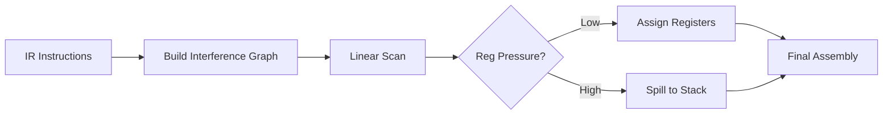

# Lesson 0068: Register Allocation

## Status: 📋 Planned | Phase: Optimization | Effort: Hard

## Objective

Minimize memory access by keeping values in registers.

## Register Allocation Pipeline



## Example

```c
// Before: stack-heavy
int a = 1;
int b = 2;
int c = a + b;
return c;

// After: register-optimized
mov $1, %eax
add $2, %eax
ret
```

## Implementation Checklist

- [ ] Linear scan register allocation
- [ ] Handle register pressure (spill to stack)
- [ ] Use callee-saved registers for locals
- [ ] Reuse registers for dead values
- [ ] Test: multiple variables stay in registers

## Implementation Details

Register allocation uses the System V ABI calling convention with stack-based local variable allocation and register-based parameter passing.

| Component | Source File | Lines | Description |
|-----------|-------------|-------|-------------|
| ABI register mapping | `src/codegen.cpp` | 267–268 | `param_regs[] = {rdi, rsi, rdx, rcx, r8, r9}` for first 6 args |
| Stack frame setup | `src/codegen.cpp` | 277–284 | Pre-allocates `sub $N, %rsp` for locals + expression temps |
| Parameter to stack | `src/codegen.cpp` | 288–291 | `mov %rdi, -8(%rbp)` etc. spills params to stack slots |
| Local variable alloc | `src/codegen.cpp` | 308–333 | Maps variable names to `-%d(%rbp)` offsets |
| Register reuse (binary) | `src/codegen.cpp` | 720–737 | Uses `%rax`/`%rcx` pair, push/pop for expression evaluation |
| Call argument passing | `src/codegen.cpp` | 839–850 | Push args right-to-left, pop into ABI registers left-to-right |
| Expression temp stack | `src/codegen.cpp` | 16 | Extra 16 stack slots for intermediate expression results |
