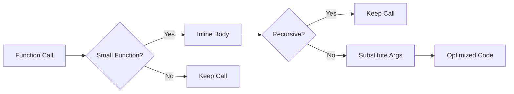

# Lesson 0069: Function Inlining

## Status: 📋 Planned | Phase: Optimization | Effort: Hard

## Objective

Replace function calls with function body.

## Function Inlining Pipeline



## Example

```c
// Before
int square(int x) { return x * x; }
int result = square(5);

// After inlining
int result = 5 * 5;
```

## Implementation Checklist

- [ ] Inline small functions (< N instructions)
- [ ] Respect `inline` keyword hints
- [ ] Never inline recursive functions
- [ ] Handle `static` functions (can inline across TU)
- [ ] Cost-benefit analysis
- [ ] Test: small function inlined, large function not
