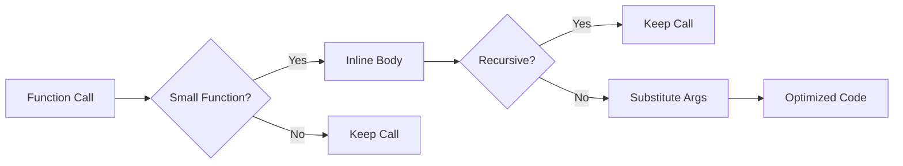

# Lesson 0069: Function Inlining

## Status: 📋 Planned | Phase: Optimization | Effort: Hard

## Objective

Replace function calls with function body.

## Function Inlining Pipeline



## Example

```c
// Before
int square(int x) { return x * x; }
int result = square(5);

// After inlining
int result = 5 * 5;
```

## Implementation Checklist

- [ ] Inline small functions (< N instructions)
- [ ] Respect `inline` keyword hints
- [ ] Never inline recursive functions
- [ ] Handle `static` functions (can inline across TU)
- [ ] Cost-benefit analysis
- [ ] Test: small function inlined, large function not

## Implementation Details

| Component | Source File | Line(s) | Description |
|-----------|------------|---------|-------------|
| `KW_INLINE` token type | `src/token.h` | 51 | Token type definition for `inline` keyword |
| `inline` keyword recognition | `src/lexer.cpp` | 40, 124 | Lexer maps `"inline"` string to `KW_INLINE` token |
| `inline` qualifier parsing | `src/parser.cpp` | 100-101 | Parser collects `inline` as a type qualifier during `parse_type_specifier()` |
| `FunctionDeclNode` AST node | `src/ast.h` | 202-211 | AST node representing function declarations (carries qualifiers) |
| `CallExprNode` AST node | `src/ast.h` | 453-460 | AST node for function call expressions to be inlined |
| Function call codegen | `src/codegen.cpp` | 257-302 | `visit(FunctionDeclNode&)` — emits function prologue/epilogue, parameter mapping |
| Compilation pipeline | `src/compiler.cpp` | 10-46 | Orchestrates tokenize → parse → codegen pipeline |
