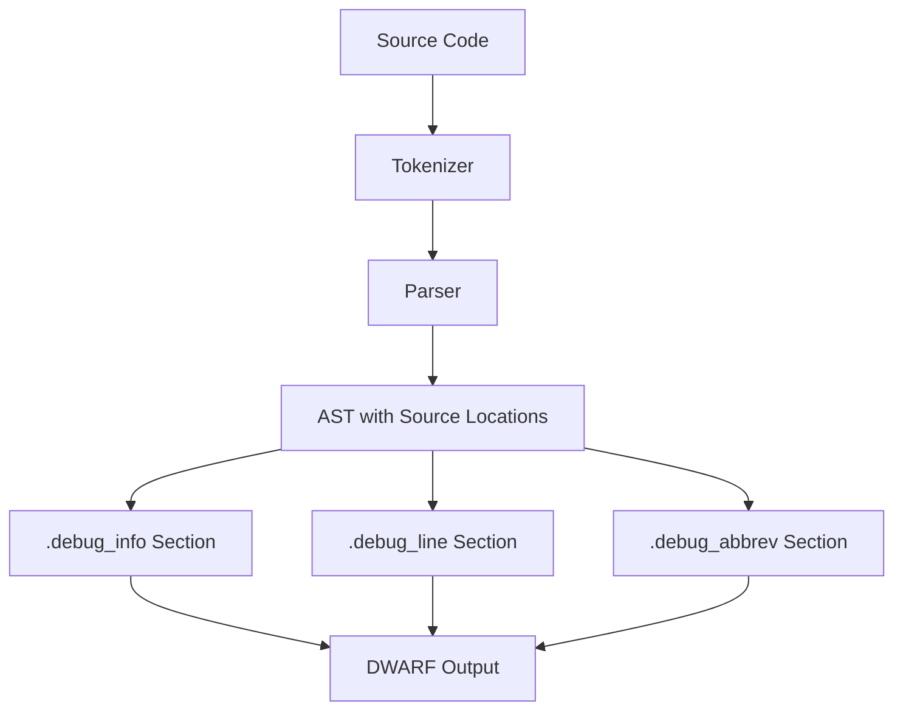

# Lesson 0070: Debug Information (DWARF)

## Status: 📋 Planned | Phase: Optimization | Effort: Hard

## Objective

Generate DWARF debug info for gdb/lldb.

## Debug Info Generation

## Implementation Checklist

- [ ] Generate `.debug_info` section
- [ ] Generate `.debug_line` section (line numbers)
- [ ] Generate `.debug_abbrev` section
- [ ] Map source locations to addresses
- [ ] Describe types and variables
- [ ] Test: `gcc -g` produces debuggable binary
