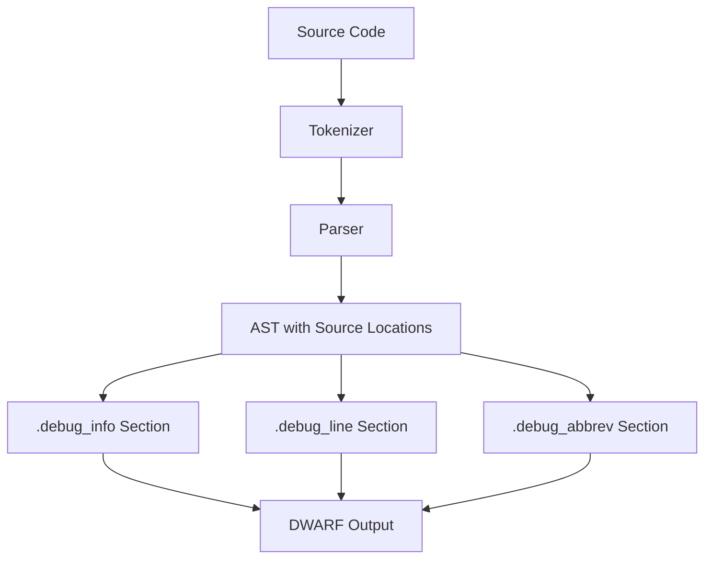

# Lesson 0070: Debug Information (DWARF)

## Status: 📋 Planned | Phase: Optimization | Effort: Hard

## Objective

Generate DWARF debug info for gdb/lldb.

## Debug Info Generation

## Implementation Checklist

- [ ] Generate `.debug_info` section
- [ ] Generate `.debug_line` section (line numbers)
- [ ] Generate `.debug_abbrev` section
- [ ] Map source locations to addresses
- [ ] Describe types and variables
- [ ] Test: `gcc -g` produces debuggable binary

## Implementation Details

| Component | Source File | Line(s) | Description |
|-----------|------------|---------|-------------|
| Token source locations | `src/token.h` | 102-111 | `Token` struct carries `line` and `column` fields for source mapping |
| Lexer source tracking | `src/lexer.h` | 49-50 | `Lexer` tracks `line_` and `column_` during tokenization |
| Lexer error locations | `src/lexer.h` | 19-21 | `error_line()` and `error_column()` expose error positions |
| AST node locations | `src/ast.h` | 173-180 | `ASTNode` base struct stores `line` and `column` for every node |
| Error location propagation | `src/compiler.cpp` | 17-21, 28-33 | `CompileResult` passes lexer/parser error locations to caller |
| Codegen emit functions | `src/codegen.cpp` | 65-87 | `emit()`, `emit_label()`, `emit_function_prologue()` — assembly output layer where debug directives would be inserted |
