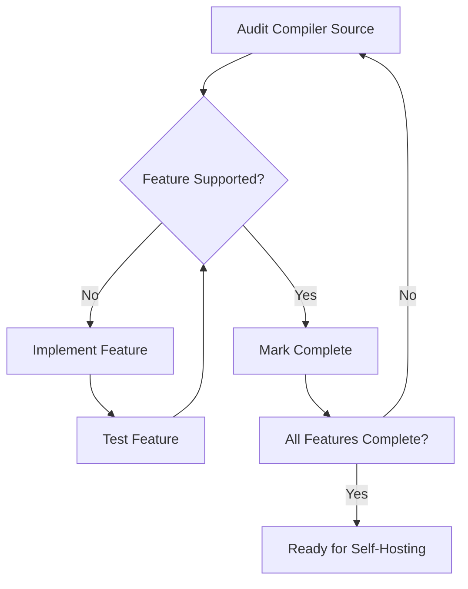

# Lesson 0071: Self-Hosting Preparation

## Status: 📋 Planned | Phase: Self-Hosting | Effort: Hard

## Objective

Prepare compiler to compile itself.

## Self-Hosting Readiness

## Requirements

To compile itself, the compiler needs to support:
- All C features used in its own source code
- Preprocessor (for headers)
- Multi-file compilation
- All data types used (structs, enums, etc.)

## Implementation Checklist

- [ ] Audit compiler source for unsupported features
- [ ] Implement missing features
- [ ] Test: compile a simplified version of the compiler
- [ ] Bootstrap: use gcc to compile simplecc, then use simplecc to compile itself
