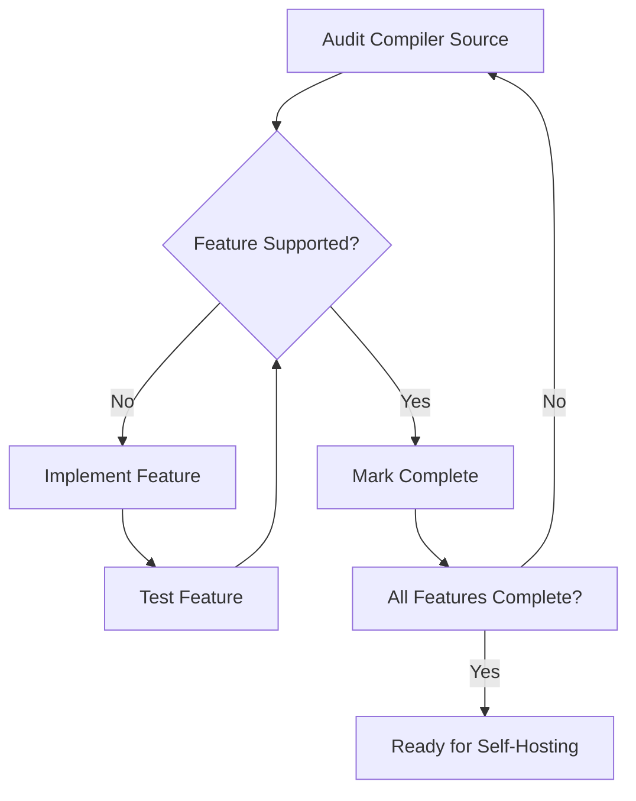

# Lesson 0071: Self-Hosting Preparation

## Status: 📋 Planned | Phase: Self-Hosting | Effort: Hard

## Objective

Prepare compiler to compile itself.

## Self-Hosting Readiness

## Requirements

To compile itself, the compiler needs to support:
- All C features used in its own source code
- Preprocessor (for headers)
- Multi-file compilation
- All data types used (structs, enums, etc.)

## Implementation Checklist

- [ ] Audit compiler source for unsupported features
- [ ] Implement missing features
- [ ] Test: compile a simplified version of the compiler
- [ ] Bootstrap: use gcc to compile simplecc, then use simplecc to compile itself

## Implementation Details

| Component | Source File | Line(s) | Description |
|-----------|------------|---------|-------------|
| Compiler entry point | `src/compiler.h` | 18-31 | `Compiler` class with `compile()` and `compile_file()` methods |
| Full compilation pipeline | `src/compiler.cpp` | 10-46 | Tokenize → parse → codegen pipeline in a single call |
| File I/O | `src/compiler.cpp` | 48-60 | `compile_file()` reads source from disk via `std::ifstream` |
| CLI interface | `src/main.cpp` | 17-85 | Command-line driver with `-S`, `-t`, `-a` flags |
| Token definitions | `src/token.h` | 9-100 | Complete `TokenType` enum covering all supported C keywords/operators |
| AST node types | `src/ast.h` | 10-61 | `NodeType` enum covering all supported C constructs |
| Lexer (all keywords) | `src/lexer.cpp` | 124 | Keyword map — must cover every keyword used in compiler source |
| Parser (declarations) | `src/parser.cpp` | 218-372 | Handles struct, enum, typedef, extern, function, and variable declarations |
| Parser (statements) | `src/parser.cpp` | 650-870 | Handles if/while/do-while/for/switch/goto/block/return statements |
| Codegen (full output) | `src/codegen.cpp` | 10-1232 | x86-64 code generation for all supported AST node types |
