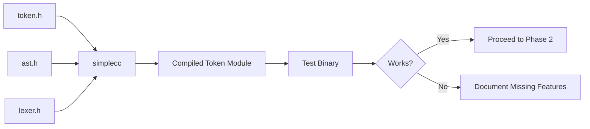

# Lesson 0072: Compile the Compiler (Phase 1)

## Status: 📋 Planned | Phase: Self-Hosting | Effort: Hard

## Objective

Use simplecc to compile a subset of its own source.

## Phase 1: Tokenize & Parse Small Modules

## Approach

1. Start with smallest modules (token.h, ast.h)
2. Gradually add more files
3. Track which features are missing

## Implementation Checklist

- [ ] Compile token.h/token.cpp with simplecc
- [ ] Compile ast.h/ast.cpp with simplecc
- [ ] Compile lexer.h/lexer.cpp with simplecc
- [ ] Document any missing features encountered
- [ ] Test: binary compiled by simplecc works correctly

## Implementation Details

| Component | Source File | Line(s) | Description |
|-----------|------------|---------|-------------|
| Token type definitions | `src/token.h` | 9-100 | `TokenType` enum — all token types the tokenizer produces |
| Token struct | `src/token.h` | 102-111 | `Token` with `type`, `value`, `line`, `column` fields |
| `Lexer::tokenize()` | `src/lexer.cpp` | 452 | Main tokenization entry point, returns `std::vector<Token>` |
| Lexer keyword map | `src/lexer.cpp` | 124 | Maps keyword strings to `TokenType` values |
| `token_type_name()` | `src/token.h` | 113 | Utility to convert token type to string for debugging |
| AST node type enum | `src/ast.h` | 10-61 | `NodeType` enum — all AST node types the parser produces |
| AST base struct | `src/ast.h` | 173-180 | `ASTNode` with `type`, `line`, `column` |
| `ASTVisitor` interface | `src/ast.h` | 126-171 | Visitor pattern for AST traversal |
| `ProgramNode` | `src/ast.h` | 185-190 | Root AST node containing all declarations |
