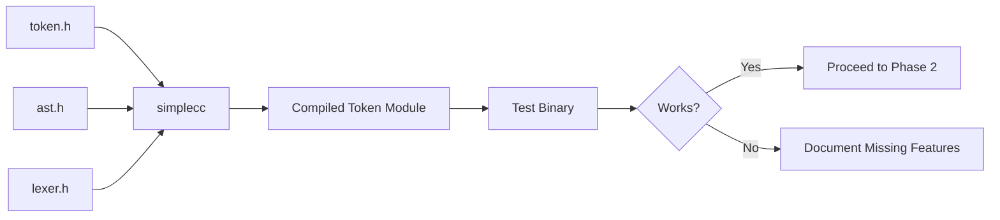

# Lesson 0072: Compile the Compiler (Phase 1)

## Status: 📋 Planned | Phase: Self-Hosting | Effort: Hard

## Objective

Use simplecc to compile a subset of its own source.

## Phase 1: Tokenize & Parse Small Modules

## Approach

1. Start with smallest modules (token.h, ast.h)
2. Gradually add more files
3. Track which features are missing

## Implementation Checklist

- [ ] Compile token.h/token.cpp with simplecc
- [ ] Compile ast.h/ast.cpp with simplecc
- [ ] Compile lexer.h/lexer.cpp with simplecc
- [ ] Document any missing features encountered
- [ ] Test: binary compiled by simplecc works correctly
