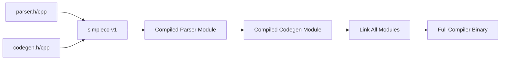

# Lesson 0073: Compile the Compiler (Phase 2)

## Status: 📋 Planned | Phase: Self-Hosting | Effort: Hard

## Objective

Compile parser and codegen with simplecc.

## Phase 2: Compile Parser & Codegen

## Implementation Checklist

- [ ] Compile parser.h/parser.cpp with simplecc
- [ ] Compile codegen.h/codegen.cpp with simplecc
- [ ] Handle any remaining missing features
- [ ] Test: full compiler compiled by simplecc
