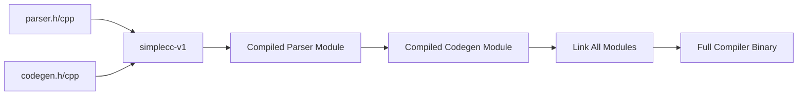

# Lesson 0073: Compile the Compiler (Phase 2)

## Status: 📋 Planned | Phase: Self-Hosting | Effort: Hard

## Objective

Compile parser and codegen with simplecc.

## Phase 2: Compile Parser & Codegen

## Implementation Checklist

- [ ] Compile parser.h/parser.cpp with simplecc
- [ ] Compile codegen.h/codegen.cpp with simplecc
- [ ] Handle any remaining missing features
- [ ] Test: full compiler compiled by simplecc

## Implementation Details

| Component | Source File | Line(s) | Description |
|-----------|------------|---------|-------------|
| `Parser::parse()` | `src/parser.cpp` | 194-195 | Entry point: delegates to `parse_program()` |
| `Parser::parse_program()` | `src/parser.cpp` | 198-214 | Iterates declarations, dispatches to statement/declaration parsers |
| Declaration parsing | `src/parser.cpp` | 218-372 | Handles extern, struct, enum, typedef, function, variable declarations |
| Statement parsing | `src/parser.cpp` | 650-870 | Handles return, if, while, do-while, for, switch, goto, block, expr-stmt |
| Expression parsing | `src/parser.cpp` | 878-1267 | Pratt parser: assignment → ternary → logical → bitwise → comparison → additive → multiplicative → unary → primary |
| `CodeGenerator::generate()` | `src/codegen.cpp` | 10-55 | Top-level: first pass collects globals/strings, second pass emits code |
| `visit(FunctionDeclNode&)` | `src/codegen.cpp` | 257-302 | Function codegen: prologue, parameter mapping, body dispatch, epilogue |
| `visit(VarDeclNode&)` | `src/codegen.cpp` | 304-343 | Variable codegen: stack allocation, address loading |
| `emit()` helpers | `src/codegen.cpp` | 65-96 | `emit()`, `emit_label()`, `emit_function_prologue()`, `emit_function_epilogue()` |
