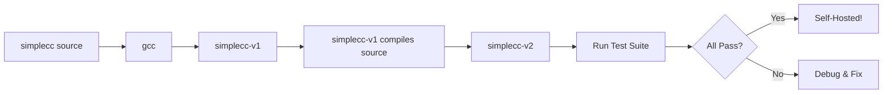

# Lesson 0074: Compile the Compiler (Phase 3)

## Status: 📋 Planned | Phase: Self-Hosting | Effort: Hard

## Objective

Full self-compilation.

## Phase 3: Full Self-Compilation

## Implementation Checklist

- [ ] Compile entire compiler with simplecc
- [ ] Run self-compiled compiler on itself
- [ ] Verify output matches gcc-compiled version
- [ ] Run test suite on self-hosted compiler
- [ ] Benchmark: compilation speed comparison
