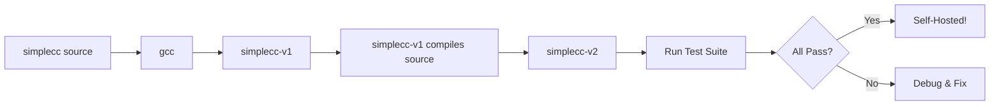

# Lesson 0074: Compile the Compiler (Phase 3)

## Status: 📋 Planned | Phase: Self-Hosting | Effort: Hard

## Objective

Full self-compilation.

## Phase 3: Full Self-Compilation

## Implementation Checklist

- [ ] Compile entire compiler with simplecc
- [ ] Run self-compiled compiler on itself
- [ ] Verify output matches gcc-compiled version
- [ ] Run test suite on self-hosted compiler
- [ ] Benchmark: compilation speed comparison

## Implementation Details

| Component | Source File | Line(s) | Description |
|-----------|------------|---------|-------------|
| Compiler orchestrator | `src/compiler.cpp` | 10-46 | `Compiler::compile()` — full tokenize → parse → codegen pipeline |
| File compilation | `src/compiler.cpp` | 48-60 | `Compiler::compile_file()` — reads file, delegates to `compile()` |
| CLI driver | `src/main.cpp` | 17-85 | `main()` — argument parsing, invokes `Compiler::compile_file()`, writes output |
| Lexer full implementation | `src/lexer.cpp` | 1-452 | Complete tokenizer: whitespace, comments, numbers, strings, identifiers, operators |
| Parser full implementation | `src/parser.cpp` | 1-1267 | Complete recursive-descent parser for all supported C constructs |
| Codegen full implementation | `src/codegen.cpp` | 1-1232 | Complete x86-64 code generator: globals, strings, functions, all expression types |
| `Compiler` class definition | `src/compiler.h` | 18-31 | Public API: `compile()`, `compile_file()`, `has_error()`, `error_message()` |
| `CompileResult` struct | `src/compiler.h` | 8-16 | Result type carrying `success`, `assembly`, error info |
