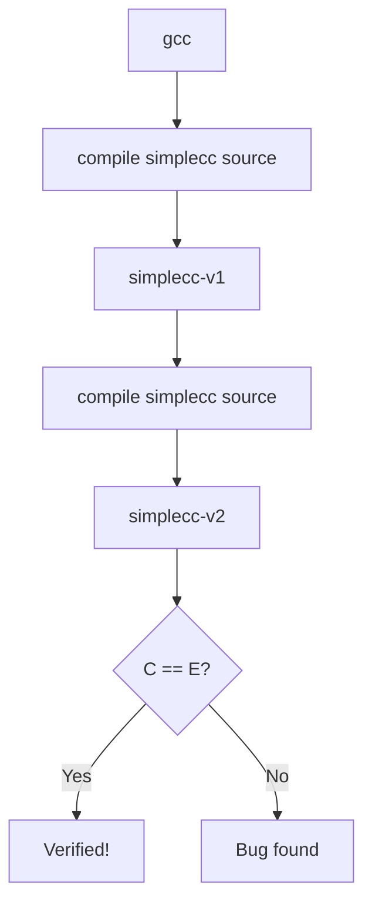

# Lesson 0075: Bootstrap and Verification

## Status: 📋 Planned | Phase: Self-Hosting | Effort: Hard

## Objective

Prove the compiler is correct via bootstrap verification.

## Bootstrap Process

## Implementation Checklist

- [ ] Build simplecc-v1 using gcc
- [ ] Build simplecc-v2 using simplecc-v1
- [ ] Compare outputs (should be identical or equivalent)
- [ ] Run full test suite on both
- [ ] Document verification results
- [ ] Celebration!
